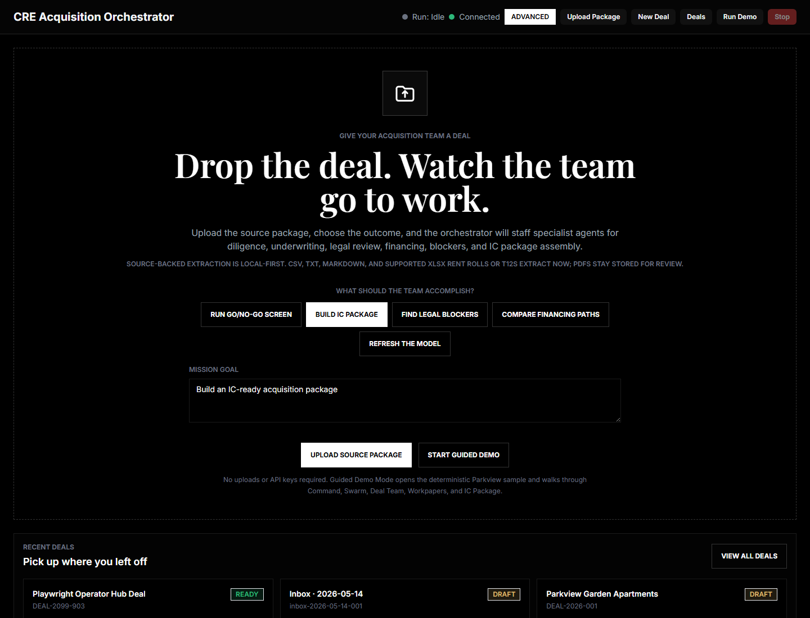
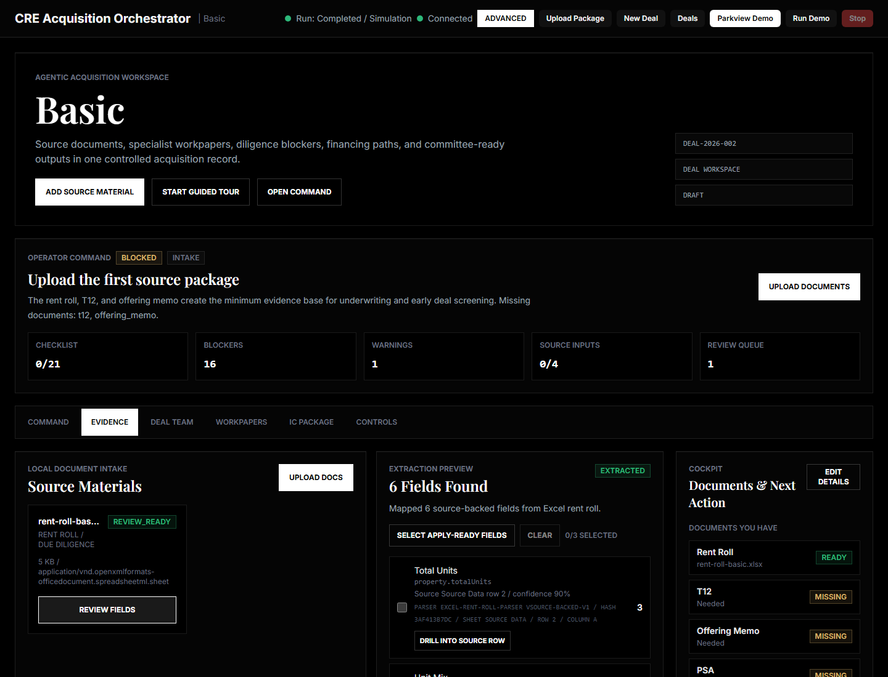
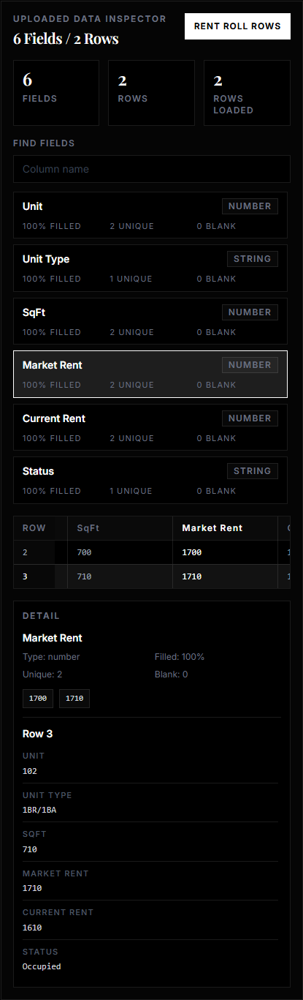
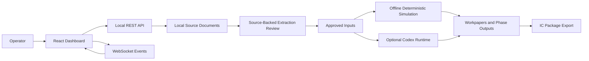

# CRE Acquisition Orchestrator

**An open-source, multi-orchestrator workspace for commercial real estate multifamily acquisitions: drop documents, state the goal, watch 31 AI roles coordinate, and review the acquisition package.**

[](LICENSE)
[](https://nodejs.org/)
[](https://www.typescriptlang.org/)
[](https://reactjs.org/)

**Fastest proof path:** run `npm run proof`, open the local dashboard, and trace one source-backed fact from upload to IC package. Full reviewer script: [Public Proof Path](docs/PROOF-PATH.md).

I've been working on something that I think the CRE industry needs, and I wanted to share where it is now.

A few months ago I wrote about [what happens when you point 489 AI agents at a 200-unit multifamily acquisition](https://avihacker.substack.com/p/489-agents-200-leases-4-hours-this). That article was the bigger vision. This repo is the engineering behind the practical open-source version: the 31 named AI roles, orchestration logic, domain knowledge files, schemas, local dashboard, deterministic simulation engine, and source-backed review workflow that make the vision usable.

**It is not fully production-ready.** I want to be direct about that. But what is here is the most in-depth open-source framework I have seen for CRE acquisition orchestration because the category barely exists. There are agent frameworks for coding, customer support, research, and data analysis. There is almost nothing that models how a real multifamily acquisition moves across due diligence, underwriting, financing, legal, and closing while preserving data handoffs, review gates, and investment committee evidence.

The default path is intentionally local. You can run the proof path with no API keys, inspect uploaded tables and source rows, review extracted candidate fields with provenance, approve or waive ambiguous values, and export Markdown/JSON for an investment committee starter package. If you want live agents, the optional ChatGPT/Codex path is there, but the offline demo remains the public proof path.

Everything in here - the agent prompts, domain skills, schemas, pipeline architecture, dashboard, and demo artifacts - is yours to use as a starting point. Fork it. Build on it. Adapt it to your own deals, investment thesis, and internal acquisition workflow. If this framework helps even one CRE team rethink how they approach acquisitions, it was worth open-sourcing.

Let's bring this industry into the future.

> **Disclaimer:** This project is a reference architecture and educational framework, not production software for making investment decisions. Nothing here is financial, legal, or investment advice.

---

## First-Time Visitor Path

- **Prove the trust loop first:** run `npm run proof` and follow the [Public Proof Path](docs/PROOF-PATH.md) from source document to uploaded data inspector to extraction review to approved evidence to workpaper to IC package.
- **Run a first real deal in 10 minutes:** follow the [First Deal Guide](docs/FIRST-DEAL-GUIDE.md), start the dashboard, drop local rent roll/T12/offering memo files, review source-backed fields, and export the IC starter package.
- **Trace the source-to-IC proof path manually:** use the [Demo Journey](docs/DEMO-JOURNEY.md#source-to-ic-proof-path) to follow a value or red flag from document drop, through uploaded data inspection, extraction review, approved evidence, workpapers, and the IC package references the current artifacts expose.
- **Use Parkview as the deterministic fallback:** click **Start Guided Demo** when you want a no-upload sample tour through the deal space - the lifecycle spine, the command bar, Your Team, the live feed, and the IC package.
- **Install from scratch:** follow [Quick Start](#quick-start). The dashboard path is local-first and the sample demo remains deterministic after dependencies are installed.
- **Choose the right runtime:** read [Offline Demo vs Live Codex Agents](docs/RUNTIME-COMPARISON.md) before sending any real deal context through the optional live-agent path.
- **Understand the system:** read [Architecture](docs/ARCHITECTURE.md), [Agent Catalog](docs/AGENT-CATALOG.md), [API Reference](docs/API-REFERENCE.md), and [WebSocket Events](docs/WEBSOCKET-EVENTS.md).
- **See where to contribute next:** review the [Roadmap](ROADMAP.md), especially legal document parsing, richer live runtime controls, OCR hardening, and additional messy parser fixtures.

For the guided path, use [First Deal Guide](docs/FIRST-DEAL-GUIDE.md). For the shortest deterministic demo, use [Quick Demo](docs/QUICK-DEMO.md).

---

## What It Does

- **Document-first deal intake** - upload rent rolls, T12s, offering memos, PDFs, and supporting files into a local workspace.
- **Uploaded data inspector** - see uploaded tables, field types, fill rates, examples, source rows, and click-through row detail before applying extracted values.
- **Source-backed extraction review** - supported XLSX/CSV/TXT/MD, text-based PDF sources, and readable scanned/image-only PDFs become candidate fields with confidence, warnings, file hashes, and source-location (sheet/row/column or page) provenance; OCR-derived fields stay review-gated before they can change deal inputs.
- **Human approval gate** - underwriting inputs do not change until the operator approves/applies trusted fields or waives/rejects ambiguous ones.
- **31-role AI deal team** - 6 orchestrators, 21 acquisition specialists, and 4 document-ingestion roles are defined as markdown prompts.
- **Visible coordination** - dashboard events show specialist messages, handoffs, dependencies, reviews, workpapers, and package status.
- **Two runtime paths** - offline deterministic simulation by default, with an optional ChatGPT-authenticated Codex CLI path for live agent workflows.

---

## By the Numbers

| AI Roles | Skills | Schemas | Workflows | Fixtures | Tests passing |
|----------|--------|---------|-----------|----------|---------------|
| 31 | 8 | 27 | 5 | 37 | 11 |

Counts reflect the current checked-in catalog: 25 specialist prompt files plus 6 orchestrators; 8 domain knowledge files; 27 JSON Schema contracts; 5 workflow definitions; 37 curated fixture files under `fixtures/` (messy parser fixtures, legal diligence checklist extraction, scanned OCR coverage, the adversarial real-world-pile smoke set, and the first-deal package); and 11 root `test*` commands tracked by [package.json](package.json).

---

## Honest Evaluation — Prove It

Architecture isn't accuracy. This repo ships an **open evaluation harness** that scores the
orchestrator on synthetic deals with known correct answers and reports honest numbers — including
where it falls short. Run it yourself:

```bash
npm run eval        # scores the benchmark -> eval/results/{scorecard.json, TRUST-REPORT.md}
```

It measures **three layers that are NOT equivalent** (full methodology + how to extend:
[eval/README.md](eval/README.md); full results: [eval/results/TRUST-REPORT.md](eval/results/TRUST-REPORT.md)):

| Layer | What it proves | Current result |
|---|---|---|
| **Extraction** (deterministic parsers) | recovering known fields from deliberately messy XLSX/PDF docs | precision/recall/F1 = **100%** across **8/8** deals |
| **Simulation** (offline demo — a *fixture*, **not** reasoning) | the deterministic engine on the benchmark | determinable financials **100%** (n=8) but IC-verdict only **75%** exact, and it **misses every narrative red flag** — it over-PASSes the tenant-concentration and insurance-understatement deals (0% recall). It computes; it does **not** reason. |
| **Live agent reasoning** (real Codex LLM — *the number that counts*) | the product's actual judgment | Codex CLI 0.132.0, 2026-05-25, **all 8 deals**: determinable financial **100%**, **narrative red-flag recall 100%**, dealbreaker recall **100%**, IC-verdict **88%** exact / **88%** directional (7 of 8). The agents genuinely flag the tenant concentration, insurance understatement, and missing Phase I the fixture is blind to. Two honest soft spots: **model-dependent returns (IRR / equity multiple) at 50%** (assumption-driven — see below), and one borderline deal (`cp-insurance-understated`) whose verdict oscillates CONDITIONAL↔FAIL across runs. |

**Honest scope:** the benchmark is **8 synthetic deals** across core-plus / value-add / distressed, with
both determinable and **narrative** (document-buried) planted risks, and the **live layer now covers all 8**.
Ground truth, the scorer, and tolerances are committed and fixed before runs; **nothing is tuned to
flatter** — the live numbers re-score the **real** Codex workpapers, and the narrative catches were verified
by reading them (e.g. *"≈60% of residents work for Carolina Logistics → correlated vacancy/rollover"*, *"only
$41K/yr insurance vs a materially higher market underwrite → DSCR ~1.15x"*). The honest weaknesses the report
still shows: **(1)** the deterministic simulation is **blind to narrative risk** (that is exactly what the
live layer is for); **(2) model-dependent returns are 50%** — IRR / equity multiple are genuinely
assumption-driven, and the live agents' return assumptions diverge from the benchmark's reference model in
**both directions** (some deals more optimistic, some more conservative), so this is a real limitation, not a
parser bug; and **(3) IC verdict is 7 of 8** — `cp-insurance-understated` is a borderline deal whose verdict
oscillates between CONDITIONAL and FAIL across runs (the agent conservatively models the understated
insurance), and this run drew FAIL. See [EVAL-PLAN.md](EVAL-PLAN.md) and
[eval/results/TRUST-REPORT.md](eval/results/TRUST-REPORT.md) for the full committed report (model, date,
per-deal results, and weaknesses).

---

## Current Status

The latest public release is `v3.1.0`. It turns the persistent deal-space dashboard into an evidence-grade source-to-IC workbench: fresh-clone setup prepares parser dependencies, source documents stay review-gated, evidence lineage travels into the IC package, `npm run verify:v3` proves the release surface end to end, and readable scanned PDFs now route through a local OCR bridge. The stable baseline remains local-first and review-first:

- **Local by default** - offline dashboard, deterministic Parkview demo, and source-backed extraction require no API keys.
- **Versioned release baseline** - `v3.1.0` adds the local scanned-PDF OCR bridge on top of `v3.0.0` evidence graph lineage, OCR-ready metadata, legal checklist candidates, proof-path UI, fresh-clone parser setup, CI, and the full `verify:v3` gate.
- **Honest evaluation** - `npm run eval` scores the orchestrator on an **8-deal** synthetic benchmark and reports honest numbers including where it falls short (see [Honest Evaluation](#honest-evaluation--prove-it)). The live (Codex) layer covers all 8 deals; the documented soft spots are model-dependent returns (~50%) and one borderline IC verdict.
- **Known limits** - the local OCR bridge supports readable scanned/image-only PDFs for review-backed headline extraction, but not arbitrary image files or fully reliable table reconstruction. Multi-tenant cloud hosting and autonomous investment decisions remain out of scope. Text-based PDF extraction, merged-cell workbooks, and single-operator self-host deployment (see [Deployment](docs/DEPLOYMENT.md)) are supported.

## Current OCR Bridge

- **Local and review-gated** - scanned/image-only PDFs are rendered locally with PyMuPDF, OCR'd with `tesseract.js`, and converted into candidate fields that must be reviewed before applying.
- **Provenance-preserving** - OCR output keeps file hash, page number, raw snippet, OCR confidence, parser id, warnings, and review status.
- **Fail-soft** - if OCR cannot read supported fields, the document remains stored with explicit OCR metadata and no guessed deal inputs.
- **Verified fixture** - `fixtures/parsers/scanned-offering-memo-ocr.pdf` proves a true image-only offering memo excerpt can extract asking price, unit count, occupancy, and NOI through the local bridge.

See [CHANGELOG.md](CHANGELOG.md) for release history.

---

## What's New in v3.1.0

- **Local scanned-PDF OCR bridge** - readable scanned/image-only PDFs render locally with PyMuPDF and run through `tesseract.js`, with no external OCR service.
- **Review-gated OCR candidates** - OCR-derived asking price, unit count, occupancy, and NOI become candidate fields with confidence, source hash, page provenance, raw snippets, parser metadata, and human review status.
- **Fail-soft scan handling** - unreadable scans or scans without supported headline fields return explicit OCR metadata and warnings instead of guessed values.
- **Fresh-clone OCR setup** - `npm run setup` installs and verifies `PyMuPDF`; npm tracks `tesseract.js`.
- **OCR fixture proof** - `fixtures/parsers/scanned-offering-memo-ocr.pdf` verifies a true image-only offering memo can extract through the local bridge.

## What's New in v3.0.0

- **Evidence-grade source-to-IC chain** - IC package JSON now includes a deterministic evidence graph connecting source documents, approved fields, agent workpapers, red flags, data gaps, and package sections. Markdown export adds an Evidence Chain section.
- **Fresh-clone parser setup** - `npm run setup` creates `.venv`, installs parser dependencies from `scripts/requirements.txt`, supports read-only `--check`, and the dashboard parser service prefers the repo virtualenv.
- **OCR-ready and legal diligence intelligence** - scanned/image-only documents expose explicit OCR-ready bridge metadata and next action; legal/closing checklists can become review-only `diligence.checklistItems` candidates with line provenance.
- **Proof-path dashboard** - Intake and IC Package views show the four-step Source doc -> Approved field -> Agent workpaper -> IC package path with conservative pending/ready states.
- **One-command release proof** - `npm run verify:v3` runs release checks, root tests, parser/workspace coverage, dashboard typecheck/build, audits, offline eval, production smoke, and full Playwright E2E. CI now runs this gate too.

## What's New in v2.8.5

- **One persistent "deal space"** - the six-tab dashboard is replaced by a single frame: a deal header + an always-visible 7-stage lifecycle spine (Intake → Diligence → Underwriting → Financing → Legal → Closing → IC) + a context-sensitive center stage + a right rail (live feed + "Your Team") + a command bar. Power-user controls (runtime/Codex limits, criteria, presets, mission control, logs, recovery) move into an Advanced drawer.
- **Intake with no manual entry** - drop the rent roll, T12, and offering memo and the deal record auto-fills from trusted source-backed values; you only edit what the team flags, and each edit persists with provenance and an audit entry. The numbers come from your documents, not a data-entry form.
- **Summon agents and watch them work** - click a teammate, type a command, or tap a chip to open a slide-in panel that streams the agent's reasoning with an elapsed timer, renders its workpaper (finding / verdict / caveats) with "open full workpaper", and takes a follow-up task. Offline replays recorded work; the live Codex runtime dispatches a single agent.
- **Re-presentation, not a rewrite** - the redesign is the new frame plus three thin, guarded backend hooks (single-agent dispatch, inline field override, per-agent stream). The engine, schemas, agents, and source-decision audit trail are unchanged, and the deterministic offline Parkview demo stays the default public path.

## What's New in v2.8.0

- **Real-world drop-flow hardening** - a messy pile of T12s, rent rolls, offering memos, and junk files flows through classify → extract → review → workflow → export with no crashes, silent skips, or confidently-wrong numbers: vacant-`$0` rent no longer deflates in-place averages, content-aware rent-roll/T12 classification, graceful `parse_failed` for oversized/corrupt inputs, path-redacted parser errors, and an automated `npm run test:pile` smoke test.
- **Threshold-driven IC verdict** - the deterministic engine consults `config/thresholds.json` for dealbreakers and a deal-specific exit cap (fixed a clean deal wrongly marked FAIL).
- **Open evaluation harness** - `npm run eval` scores an **8-deal** synthetic benchmark (with `npm run eval:offline` for the no-API layers) and writes an honest trust report. The live (Codex) layer proves the agents catch narrative risks the deterministic fixture is blind to (red-flag recall 100%, IC verdict 88%, determinable 100%), with model-dependent returns (~50%) documented as an honest limit. See [Honest Evaluation](#honest-evaluation--prove-it).

## What's New in v2.7.0

- **Text-based PDF extraction** - offering memos and rent rolls in PDF now produce source-backed candidate fields with per-field confidence and page-level provenance; scanned/image-only PDFs are detected, marked OCR-ready, and held for local review-gated OCR rather than silently skipped.
- **Legal checklist candidates** - Markdown/TXT legal or diligence checklists can produce low-confidence `diligence.checklistItems` candidates with line provenance for operator review, without auto-applying economics.
- **Tougher spreadsheet parsing** - merged-cell workbooks are unmerged and forward-filled before header detection, image-only workbooks are flagged, and new fixtures cover currency symbols, subtotal/total rows, trailing notes, and synonym headers.
- **Review-grade workpapers** - workpaper quality gates (cited inputs, assumptions, calculations, caveats, reviewer signoff), per-phase evidence-completeness scoring, IC red-flag drilldowns back to the originating workpaper/source, and richer IC export with source drilldowns and package version history.
- **Source-decision audit trail** - timestamped approve/reject/waive history per field with cross-document conflict blocking, plus field-level provenance deep links from an approved input to its source snippet.
- **Live Codex runtime hardening** - per-agent retry/backoff, partial-failure re-run-only-failed-agents, secret redaction at the logging boundary, a redacted sample run manifest with its own schema, and an operator "retry failed agents" recovery action.
- **Single-operator self-host deployment** - `npm run serve` serves the built dashboard plus the loopback API/WS together (loopback-default, not multi-tenant); see [docs/DEPLOYMENT.md](docs/DEPLOYMENT.md).
- **Contributor experience** - an end-to-end "add a new specialist agent" guide, a dashboard architecture map, and a `npm run release:check` readiness gate.

## Release Journey

This project has grown from agent architecture into a local-first acquisition workspace: first the orchestration catalog, then a usable dashboard, then live Codex-backed execution, then a document-first cockpit, then an operator workbench, then an agentic deal-team workspace, then source-backed deal intake, then a credibility-hardened sample package with strict schemas, then a completion pass adding PDF extraction and review-grade workpapers, then real-world drop-flow hardening with an honest evaluation harness, then a redesign into one persistent deal space you drive by summoning agents, and now an evidence-grade source-to-IC workbench with full release verification.

| Release | What Changed | Full Notes |
|---------|--------------|------------|
| **v1.0.0 - Initial Public Release** | Published the first open-source CRE acquisition orchestration framework: markdown agents, phase orchestration, schemas, domain skills, deterministic simulation, and sample Parkview output. | [GitHub Release](https://github.com/ahacker-1/cre-acquisition-orchestrator/releases/tag/v1.0.0) |
| **v1.1.0 - Dashboard Deal Wizard** | Moved setup into the product with a guided New Deal Wizard, saved deal library, launch-ready deal flow, and Playwright coverage for key dashboard paths. | [RELEASE_NOTES_v1.1.0.md](RELEASE_NOTES_v1.1.0.md) |
| **v2.0.0 - Operator Deal Hub** | Turned the dashboard into a local-first acquisition cockpit with phase workspaces, document intake, source-backed inputs, outcome workflows, presets, and completion packages. | [RELEASE_NOTES_v2.0.0.md](RELEASE_NOTES_v2.0.0.md) |
| **v2.1.0 - Codex / ChatGPT Workflow Runtime** | Added the optional live-agent path: ChatGPT-authenticated Codex CLI execution, in-app login status, dashboard-launched Codex runs, and release-ready setup validation. | [RELEASE_NOTES_v2.1.0.md](RELEASE_NOTES_v2.1.0.md) |
| **v2.2.0 - Document-First Acquisition Cockpit** | Made the dashboard front door document-first with quick draft creation, upload-to-documents routing, compact recent deals, and a persistent cockpit sidebar. | [RELEASE_NOTES_v2.2.0.md](RELEASE_NOTES_v2.2.0.md) |
| **v2.3.0 - Operator Workbench** | Added guided deal progression, workflow readiness, upload queue recovery, source-backed change review, safer embedded launch scoping, IC review handoff, and verified public feature paths. | [RELEASE_NOTES_v2.3.0.md](RELEASE_NOTES_v2.3.0.md) |
| **v2.4.0 - Agentic Deal Team Workspace** | Reframed the dashboard around Acquisition Command, mission intent, visible agent handoffs, specialist team activity, workpapers/evidence, and IC package assembly. | [RELEASE_NOTES_v2.4.0.md](RELEASE_NOTES_v2.4.0.md) |
| **v2.5.0 - Source-Backed Deal Intake** | Turned XLSX/CSV rent rolls and T12s into persisted, reviewable, provenance-backed candidate fields operators can approve/apply before workflows use them. | [RELEASE_NOTES_v2.5.0.md](RELEASE_NOTES_v2.5.0.md) |
| **v2.5.1 - Stale Source Evidence Gate** | Added source-freshness protection to workflow launch readiness and bumped the package baseline to `2.5.1`. | [GitHub Tag](https://github.com/ahacker-1/cre-acquisition-orchestrator/tree/v2.5.1) |
| **v2.6.0 - Credibility and Infrastructure Hardening** | Aligns Parkview around Austin, replaces stub workpapers, enforces strict schemas/enums, hardens local security, documents APIs/events, and refreshes public repo infrastructure. | [RELEASE_NOTES_v2.6.0.md](RELEASE_NOTES_v2.6.0.md) |
| **v2.7.0 - Completion Pass** | Closes the prior known limits (text-based PDF extraction, merged-cell/image-only workbooks, single-operator self-host deployment) and implements the ROADMAP near-term priorities: review-grade workpapers, live Codex runtime hardening, source-decision audit trail, and contributor tooling. | [GitHub Release](https://github.com/ahacker-1/cre-acquisition-orchestrator/releases/tag/v2.7.0) |
| **v2.8.0 - Drop-Flow Hardening + Honest Eval** | Hardens the real-world document-drop journey (parser confident-wrong/robustness fixes, content-aware classification, threshold-driven IC verdict, `npm run test:pile`) and ships an open evaluation harness with an honest trust report — live agents scored on all 8 synthetic deals, proving narrative-risk detection while honestly documenting the model-dependent-returns soft spot. | [GitHub Release](https://github.com/ahacker-1/cre-acquisition-orchestrator/releases/tag/v2.8.0) |
| **v2.8.5 - Deal Workspace Redesign** | Redesigns the operator dashboard into one persistent "deal space" — a lifecycle spine + auto-filling intake (drop documents, edit only what's flagged) + summonable agent panels that stream work and render workpapers — as presentation plus three thin backend hooks, engine and audit trail unchanged, offline demo still the default. | [GitHub Release](https://github.com/ahacker-1/cre-acquisition-orchestrator/releases/tag/v2.8.5) |
| **v3.0.0 - Evidence-Grade Workbench** | Adds fresh-clone parser setup, OCR-ready metadata, legal checklist candidates, deterministic evidence graph lineage, proof-path dashboard UI, CI, and the full `npm run verify:v3` release gate. | [RELEASE_NOTES_v3.0.0.md](RELEASE_NOTES_v3.0.0.md) |
| **v3.1.0 - Local OCR Bridge** | Adds local scanned-PDF OCR with PyMuPDF and `tesseract.js`, review-gated OCR candidates, OCR fixture coverage, and setup/docs support. | [RELEASE_NOTES_v3.1.0.md](RELEASE_NOTES_v3.1.0.md) |

---

## Visual Demo Tour

The public demo is intentionally visual: a first-time visitor should understand the workspace before they read the architecture. The path below starts at the front door, drops a document package into **Intake**, inspects the uploaded tables field by field, then moves through the persistent deal space - the lifecycle spine, the agents at work, and the IC package - using the deterministic Parkview sample so it populates with no API keys.

### 1. Front Door - drop your deal, watch your team go to work



### 2. Intake - drop documents, the record auto-fills



### 3. Uploaded Data Inspector - see every field and click into rows



### 4. The Deal Space - one frame, the whole lifecycle


### 5. Watch It Work - summon an agent, read its workpaper


### 6. IC Package - decision-ready acquisition package


See [Demo Journey](docs/DEMO-JOURNEY.md) for the storyboard, screenshot refresh path, and the source-to-IC proof script a visitor can follow without a video.

---

## Architecture

The system uses a three-level hierarchy: one master orchestrator coordinates five phase orchestrators, which manage specialist agents across diligence, underwriting, financing, legal, closing, and document ingestion. The canonical open-source catalog is 31 named AI roles: 6 orchestrators, 21 acquisition specialists, and 4 source-document ingestion roles.

```mermaid
graph TD
    M[Master Orchestrator] --> DD[Due Diligence Orchestrator]
    M --> UW[Underwriting Orchestrator]
    M --> FIN[Financing Orchestrator]
    M --> LEG[Legal Orchestrator]
    M --> CLO[Closing Orchestrator]

    DD --> ING[Document Ingestion Layer]
    ING --> DO[Document Orchestrator]
    ING --> RRP[Rent Roll Parser]
    ING --> FP[Financials Parser]
    ING --> OMP[Offering Memo Parser]

    DD --> RRA[Rent Roll Analyst]
    DD --> OPEX[OpEx Analyst]
    DD --> ENV[Environmental Review]
    DD --> LTR[Legal Title Review]
    DD --> MS[Market Study]
    DD --> PI[Physical Inspection]
    DD --> TC[Tenant Credit]

    UW --> FMB[Financial Model Builder]
    UW --> SA[Scenario Analyst]
    UW --> ICM[IC Memo Writer]

    FIN --> LO[Lender Outreach]
    FIN --> QC[Quote Comparator]
    FIN --> TSB[Term Sheet Builder]

    LEG --> PSA[PSA Reviewer]
    LEG --> EST[Estoppel Tracker]
    LEG --> INS[Insurance Coordinator]
    LEG --> LDR[Loan Doc Reviewer]
    LEG --> TSR[Title Survey Reviewer]
    LEG --> TDP[Transfer Doc Preparer]

    CLO --> CC[Closing Coordinator]
    CLO --> FFM[Funds Flow Manager]
```



Each role is a plain Markdown prompt with responsibilities, inputs, outputs, escalation paths, and handoff expectations. That is deliberate: operators and engineers can inspect the role design before trusting the runtime.

---

## Runtime Flow



The source-to-IC proof path is the public trust loop: local source documents become reviewable candidates, approved inputs shape deterministic/offline or optional live-agent workpapers, and the IC package exports the available decision trail for human review. The offline simulation path stays local after dependencies are installed. The optional live Codex path sends selected prompts and deal context through the user's ChatGPT-authenticated Codex CLI session, then writes raw Codex outputs and dashboard-readable package artifacts back into the local `data/` tree. Authentication is not stored in this repository.

---

## The Pipeline

| Phase | What Happens | Example Outputs |
|-------|--------------|-----------------|
| 1. Document Intake | Operator uploads source files, classifies document types, and previews parser output. | Source manifest, hashes, extraction candidates, warnings |
| 2. Source Review | Candidate fields are accepted, rejected, or waived before they become underwriting inputs. | Approved rent roll fields, T12 fields, provenance trail |
| 3. Due Diligence | Specialists review rent roll, operating expenses, physical condition, market, title, environment, and tenant credit. | Unit mix, rent roll analysis, OpEx notes, diligence flags |
| 4. Underwriting | The model builder, scenario analyst, and IC memo writer translate inputs into an investment view. | 10-year pro forma, 27-scenario matrix, DSCR, IRR, equity multiple |
| 5. Financing | Lender outreach and quote comparison turn deal metrics into debt strategy. | Loan sizing, lender quote comparison, term-sheet draft |
| 6. Legal | PSA, title/survey, loan documents, insurance, estoppels, and transfer documents move through review. | Legal checklist, estoppel tracker, PSA risk notes, closing conditions |
| 7. Closing | Closing coordinator and funds-flow manager assemble close mechanics. | Closing checklist, prorations, wire schedule, funds-flow workpaper |
| 8. IC Package | The workspace gathers outputs into a decision package. | Markdown package, JSON export, manifest, review trail |

The Parkview sample follows this path end to end with deterministic data so contributors can validate behavior without API keys or private deal files.

---

## Complete Agent Catalog

The full agent catalog is intentionally in the README. A visitor should be able to feel the depth of the system immediately, not after clicking through five files. [docs/AGENT-CATALOG.md](docs/AGENT-CATALOG.md) remains the companion reference, but the core map lives here too.

The canonical open-source catalog contains **31 named AI roles**: 6 orchestrators, 21 acquisition specialists, and 4 source-document ingestion roles. The 21 acquisition specialists follow the 19-section prompt anatomy defined in [Agent Development](docs/AGENT-DEVELOPMENT.md) (the canonical specification), which is the authority for section names and order. The 6 orchestrators use a purpose-built orchestrator template and the 4 ingestion roles use a minimal document-parser template, so they do not follow the specialist 19-section spec.

### Phase Map

| Phase | Starts When | Key Agents | Output |
|-------|-------------|------------|--------|
| **Due Diligence** | Immediately | Rent Roll Analyst, OpEx Analyst, Physical Inspection, Market Study, Environmental Review, Legal & Title Review, Tenant Credit | Property risk profile, market positioning, physical condition assessment |
| **Underwriting** | DD 100% complete | Financial Model Builder, Scenario Analyst, IC Memo Writer | Pro forma financials, 27-scenario stress test, investment committee memo |
| **Financing** | UW 100% complete | Lender Outreach, Quote Comparator, Term Sheet Builder | Lender quotes, comparative analysis, recommended term sheet |
| **Legal** | DD 80% complete | PSA Reviewer, Title & Survey Reviewer, Estoppel Tracker, Loan Doc Reviewer, Insurance Coordinator, Transfer Doc Preparer | Contract review, title clearance, closing document preparation |
| **Closing** | All prior phases complete | Closing Coordinator, Funds Flow Manager | Final closing checklist, funds flow schedule, transfer execution |

Legal starts at DD 80% completion to model how real CRE deals work: legal review begins before all diligence is complete, but the Loan Doc Reviewer waits for Financing output before reviewing loan documents.

### Orchestrators (6)

| Agent | Role | Manages |
|-------|------|---------|
| **[Master Orchestrator](orchestrators/master-orchestrator.md)** | Full pipeline coordinator | 5 phase orchestrators, phase dependency enforcement, final go/no-go verdict |
| **[Due Diligence Orchestrator](orchestrators/due-diligence-orchestrator.md)** | DD phase manager | 7 specialist agents, parallel launch with dependency ordering |
| **[Underwriting Orchestrator](orchestrators/underwriting-orchestrator.md)** | UW phase manager | 3 agents in sequence: model, scenarios, IC memo |
| **[Financing Orchestrator](orchestrators/financing-orchestrator.md)** | Financing phase manager | 3 agents: parallel lender outreach, sequential quote comparison and term sheet |
| **[Legal Orchestrator](orchestrators/legal-orchestrator.md)** | Legal phase manager | 6 agents, early start at DD 80%, Loan Doc Reviewer waits for financing |
| **[Closing Orchestrator](orchestrators/closing-orchestrator.md)** | Closing phase manager | 2 agents: closing coordinator, then funds flow manager |

### Due Diligence Specialists (7)

| Agent | What It Does | Key Outputs |
|-------|-------------|-------------|
| **[Rent Roll Analyst](agents/due-diligence/rent-roll-analyst.md)** | Validates unit mix, in-place rents vs market, loss-to-lease calculation, occupancy, tenant concentration risk, and anomaly detection | Unit mix summary, rent comp analysis, loss-to-lease matrix, anomaly flags |
| **[OpEx Analyst](agents/due-diligence/opex-analyst.md)** | Analyzes T-12 operating statement, per-unit expense benchmarking, line-item trends, management fee validation, and tax reassessment modeling | Expense analysis, per-unit benchmarks, anomaly flags, tax projection |
| **[Physical Inspection](agents/due-diligence/physical-inspection.md)** | Assesses property condition, estimates capital expenditure needs by system, calculates remaining useful life, and quantifies deferred maintenance | Physical condition report, CapEx schedule, deferred maintenance estimate |
| **[Market Study](agents/due-diligence/market-study.md)** | Reviews submarket fundamentals, demographics, employment, supply pipeline, absorption, rent comps, and competitive positioning | Market analysis, rent comps, competitive positioning, demand forecast |
| **[Environmental Review](agents/due-diligence/environmental-review.md)** | Evaluates Phase I ESA findings, contamination risk, regulatory compliance, remediation cost, vapor intrusion, and adjacent property concerns | Environmental risk score, remediation needs, regulatory flags |
| **[Legal & Title Review](agents/due-diligence/legal-title-review.md)** | Analyzes title commitment, exceptions, encumbrances, easements, liens, deed restrictions, and HOA/CC&R issues | Title analysis, exception review, encumbrance schedule |
| **[Tenant Credit](agents/due-diligence/tenant-credit.md)** | Evaluates tenant creditworthiness, income concentration, lease rollover exposure, subsidy exposure, and credit scoring | Tenant credit report, concentration risk matrix, rollover schedule |

### Underwriting Specialists (3)

| Agent | What It Does | Key Outputs |
|-------|-------------|-------------|
| **[Financial Model Builder](agents/underwriting/financial-model-builder.md)** | Builds a 10-year pro forma: GPI, vacancy, concessions, bad debt, EGI, OpEx, NOI, debt service, cash flow, reversion, stabilization, renovation impact, and refinancing scenarios | Base case pro forma, cash flow projections, return metrics |
| **[Scenario Analyst](agents/underwriting/scenario-analyst.md)** | Runs 27 sensitivity scenarios by varying rent growth, vacancy, and exit cap rate across three levels each | Scenario matrix, sensitivity tables, break-even analysis, downside risk quantification |
| **[IC Memo Writer](agents/underwriting/ic-memo-writer.md)** | Synthesizes diligence and underwriting outputs into a structured investment committee memorandum | Investment committee memo, decision card, risk-weighted recommendation |

### Financing Specialists (3)

| Agent | What It Does | Key Outputs |
|-------|-------------|-------------|
| **[Lender Outreach](agents/financing/lender-outreach.md)** | Solicits quotes across Agency, CMBS, Life Companies, Banks, Bridge, and Mezzanine sources | Lender list, outreach results, initial quotes, lender fit scoring |
| **[Quote Comparator](agents/financing/quote-comparator.md)** | Compares rate, term, LTV, DSCR, prepayment, recourse, rate lock, deposit, and lender fit | Quote comparison matrix, weighted ranking, recommended lender |
| **[Term Sheet Builder](agents/financing/term-sheet-builder.md)** | Drafts term sheet, identifies negotiation leverage, flags non-standard terms, and models rate-lock scenarios | Term sheet draft, negotiation points, rate-lock analysis |

### Legal Specialists (6)

| Agent | What It Does | Key Outputs |
|-------|-------------|-------------|
| **[PSA Reviewer](agents/legal/psa-reviewer.md)** | Reviews Purchase & Sale Agreement clauses, contingencies, representations, earnest money, closing conditions, seller obligations, and assignment rights | PSA analysis, risk flags, deadline calendar, negotiation recommendations |
| **[Title & Survey Reviewer](agents/legal/title-survey-reviewer.md)** | Reviews title commitment and ALTA survey for boundary issues, easements, encroachments, flood zone, and zoning compliance | Title/survey review, exception analysis, survey issue map |
| **[Estoppel Tracker](agents/legal/estoppel-tracker.md)** | Manages estoppel collection and validates tenant-reported terms against the rent roll | Estoppel status tracker, discrepancy report, completion percentage |
| **[Loan Doc Reviewer](agents/legal/loan-doc-reviewer.md)** | Reviews note, mortgage/deed of trust, guaranty, environmental indemnity, and UCC filings against the term sheet | Loan doc review, compliance check, deviation flags |
| **[Insurance Coordinator](agents/legal/insurance-coordinator.md)** | Verifies lender and PSA insurance requirements, property coverage, liability, flood, windstorm, umbrella, and broker coordination | Insurance compliance report, coverage gap analysis, premium estimates |
| **[Transfer Doc Preparer](agents/legal/transfer-doc-preparer.md)** | Prepares deed, bill of sale, assignment of leases, FIRPTA certificate, transfer tax calculations, entity verification, and closing statement review | Transfer document drafts, entity verification, transfer tax calculation |

### Closing Specialists (2)

| Agent | What It Does | Key Outputs |
|-------|-------------|-------------|
| **[Closing Coordinator](agents/closing/closing-coordinator.md)** | Manages closing checklist, verifies conditions precedent, tracks outstanding items, coordinates timeline, and performs final readiness assessment | Closing checklist, readiness score, outstanding items tracker |
| **[Funds Flow Manager](agents/closing/funds-flow-manager.md)** | Prepares funds flow memo, purchase price allocation, prorations, lender disbursement, escrow holdbacks, wire instructions, and closing cost breakdown | Funds flow memo, wire instructions, proration schedule, closing cost summary |

### Document Ingestion Agents (4)

| Agent | What It Does | Key Outputs |
|-------|-------------|-------------|
| **[Document Orchestrator](agents/ingestion/document-orchestrator.md)** | Classifies incoming documents, routes to the right parser, manages extraction pipeline, and validates completeness | Document manifest, extraction status, routing decisions |
| **[Rent Roll Parser](agents/ingestion/rent-roll-parser.md)** | Extracts structured rent roll data from CSV, text/markdown, and supported XLSX rent rolls with operator review before apply | Structured rent roll JSON, extraction confidence, source provenance, review status |
| **[Financials Parser](agents/ingestion/financials-parser.md)** | Extracts T-12 operating statements, income line items, expense categories, and month-over-month trends | Structured financials JSON, line-item mapping |
| **[Offering Memo Parser](agents/ingestion/offering-memo-parser.md)** | Extracts property details, investment highlights, financial projections, and market data from offering memoranda | Structured property data, financial assumptions, market summary |

---

## Domain Knowledge Base

| Skill File | What It Gives the Agents |
|------------|--------------------------|
| [underwriting-calc.md](skills/underwriting-calc.md) | EGI/NOI definitions, concessions, bad debt, RUBS treatment, DSCR, cap rate, IRR, sensitivity math, and worked examples. |
| [multifamily-benchmarks.md](skills/multifamily-benchmarks.md) | 2026 multifamily operating benchmarks, replacement reserves, and market sanity checks. |
| [lender-criteria.md](skills/lender-criteria.md) | Agency, bank, CMBS, debt fund, life company, bridge, DSCR, and construction lending criteria. |
| [legal-checklist.md](skills/legal-checklist.md) | PSA, title, survey, estoppel, loan document, entity, transfer, and closing legal review coverage. |
| [risk-scoring.md](skills/risk-scoring.md) | Risk severity, likelihood, mitigation, escalation, and recommendation framing. |
| [checkpoint-protocol.md](skills/checkpoint-protocol.md) | Runtime status, phase dependency, and state persistence conventions. |
| [logging-protocol.md](skills/logging-protocol.md) | Structured event and audit trail expectations. |
| [self-review-protocol.md](skills/self-review-protocol.md) | Agent self-checks before handoff or finalization. |

Domain files intentionally separate reusable CRE policy from individual agent prompts. When a threshold or formula changes, the goal is to update the canonical skill first, then keep agents and fixtures aligned.

---

## Data Contracts

The repo ships 27 JSON Schema contracts under [schemas/](schemas/), validated with AJV strict mode and shared enum refs.

| Contract Area | Files | Purpose |
|---------------|-------|---------|
| Shared primitives | [schemas/common/](schemas/common/) | Canonical statuses, verdicts, flags, checklist items, and agent findings. |
| Phase outputs | [schemas/phases/](schemas/phases/) | Closed contracts for due diligence, underwriting, financing, legal, and closing outputs. |
| Per-agent outputs | [schemas/agents/](schemas/agents/) | Agent-specific validation for rent roll, OpEx, financial model, scenario, lender, legal, and closing work. |
| Runtime checkpoints | [schemas/checkpoint/](schemas/checkpoint/) | Master and agent checkpoint persistence contracts. |
| Document manifests | [schemas/documents/manifest.schema.json](schemas/documents/manifest.schema.json) | Local source-document inventory, hashes, and extraction status. |
| Event payloads | [schemas/events/phase-completion.schema.json](schemas/events/phase-completion.schema.json) | Phase completion events consumed by the dashboard and validation scripts. |
| Live-run manifest | [schemas/codex/run-manifest.schema.json](schemas/codex/run-manifest.schema.json) | Redacted Codex live-run manifest: run outcome, per-agent attempts, and failed-agent list. |
| Workpaper quality gate | [schemas/workpapers/quality-gate.schema.json](schemas/workpapers/quality-gate.schema.json) | Workpaper quality-gate block: cited inputs, assumptions, calculations, caveats, and reviewer signoff. |

Schema validation is part of the public credibility story: extra fields fail, legacy enum values fail, and Parkview fixtures must continue to validate.

---

## Operator Dashboard

The dashboard is a single **persistent deal space**, not a set of tabs. One frame stays in place; only the focused stage's body swaps. The frame has four fixed regions:

- **Deal header** - the deal name, key facts (units, price, location), and live IC-package readiness.
- **Lifecycle spine** - an always-visible row of the seven deal stages: **Intake → Diligence → Underwriting → Financing → Legal → Closing → IC**. Each stage carries a status dot (live, done, needs-your-eye, blocked, idle); clicking a stage focuses the center stage on it. The spine replaces the old six-tab nav.
- **Center stage** - the focused stage's body: its agents at work and the outputs they file. **Intake** is the opener - drop the document package, ingestion agents auto-extract, and the deal record auto-fills (trusted fields apply on read; you edit only flagged values inline, with full source provenance one tap away). The five orchestrated phases each show their specialists, streaming progress, and workpapers. **IC** assembles the committee package (recommendation, phase outcomes, red flags, data gaps, manifest, export).
- **Right rail + command bar** - a **Live Feed** (a chronological war-room stream of every agent's activity) and **Your Team** (the specialists staffed on the focused stage, with a "summon any of 31 agents" picker) sit in the rail; a persistent **command bar** ("Tell your team what to do…" plus context-aware suggestion chips) runs along the bottom. Clicking an agent - from the rail, a chip, or the command bar - opens a side **AgentPanel** that streams that one agent's work and shows its workpaper.

Power-user controls move off the primary path into an **Advanced drawer** (deal criteria/target overrides, the workflow launcher for simulation or live Codex runs, mission control, the deal-team tree, workpapers, pipeline view, story/timeline, and the partial-failure "retry failed agents" recovery panel).

The dashboard is intentionally not a landing page. It is the actual workspace: a local operator can drop documents, watch the team work the lifecycle, decide what to trust, and export a package.

---

## Quick Start

### Prerequisites

- [Node.js](https://nodejs.org/) 18+
- npm
- Python 3.9+ for the local parser virtual environment (`pandas`, `openpyxl`, `pdfplumber`, `PyMuPDF`)
- Google Chrome or Microsoft Edge for local browser E2E, unless Playwright's bundled Chromium is installed
- Optional for live AI runs: [OpenAI Codex CLI](https://github.com/openai/codex) signed in with ChatGPT

From a fresh clone on Windows:

```powershell
git clone https://github.com/ahacker-1/cre-acquisition-orchestrator.git
cd cre-acquisition-orchestrator

npm install
npm run setup -- --skip-codex-install --skip-login
npm run proof
```

Open `http://localhost:5173` if the browser does not open automatically. The proof path regenerates deterministic Parkview artifacts, starts the dashboard, waits for the local UI/API to respond, and works even if Codex is missing or login is skipped.
`npm run setup -- --skip-codex-install --skip-login` also prepares the local parser virtual environment used for XLSX/PDF extraction without starting the optional Codex/ChatGPT auth path.

To require a complete live-agent setup during onboarding:

```powershell
npm run setup -- --require-codex
```

Check Codex auth status:

```powershell
npm run codex:status
```

Expected login output should say `Logged in using ChatGPT`.

---

## Common Runs

Run the public proof path:

```powershell
npm run proof
```

This regenerates Parkview, starts the dashboard, opens the local app, and points you to [Public Proof Path](docs/PROOF-PATH.md) so you can inspect source data, approve evidence, and trace it into the IC package.

Run the first real-deal workspace:

```powershell
npm run dashboard
```

Inside the workspace, drop your source files into **Intake** - the ingestion agents extract them and the deal record auto-fills, so you only correct flagged values - then advance through the lifecycle spine and export the **IC** package as Markdown or JSON.

Run the deterministic Parkview demo:

```powershell
npm run demo
```

Verify the offline demo path:

```powershell
npm run demo:verify
```

Run browser E2E coverage:

```powershell
npm run test:e2e
```

Run the full verified workbench gate before a release or serious demo:

```powershell
npm run verify:v3
```

Run a small live Codex smoke test after ChatGPT login:

```powershell
npm run codex:smoke
```

---

## Key Features

| Capability | Why It Matters |
|------------|----------------|
| **31-role acquisition team** | The repo models a real acquisition desk with orchestrators, diligence specialists, underwriting, financing, legal, closing, and ingestion roles instead of one generic assistant. |
| **19-section prompt anatomy** | The 21 acquisition specialists follow the 19-section anatomy from [Agent Development](docs/AGENT-DEVELOPMENT.md) (identity, mission, inputs, strategy, outputs, checkpoint/logging/resume protocols, error recovery, dealbreaker detection, confidence scoring, downstream contract, self-review, and self-validation). Orchestrators and ingestion roles use their own purpose-specific templates. |
| **Local source-package review** | Operators can drop deal files into a local workspace, inspect extracted fields, review source provenance, and decide what becomes deal data. |
| **Human approval gate** | The system is designed around operator judgment: candidate fields are accepted, rejected, waived, or left unresolved before workflows consume them. |
| **Strict schema contracts** | Phase outputs, agent findings, checkpoints, document manifests, and events validate against JSON Schema with shared enums and closed objects. |
| **Deterministic Parkview demo** | A complete Austin/Travis County sample run produces populated reports and workpapers with no API keys. |
| **Optional live Codex runtime** | Teams that want live AI execution can use a ChatGPT-authenticated Codex CLI path without making that the default public demo dependency. |
| **Operator dashboard** | The React workspace is one persistent deal space: a lifecycle spine from Intake to IC, the agents at work on the focused stage, a live feed, a command bar to dispatch the team, and IC package assembly - all in one frame. |
| **Public validation harness** | Demo verification, parser tests, workspace tests, schema tests, security assertions, docs drift checks, and browser E2E coverage are part of the repo. |
| **Open, inspectable domain layer** | CRE assumptions live in Markdown skill files and JSON config, so operators can see and change the policy rather than trusting hidden code. |

---

## Project Structure

```text
cre-acquisition-orchestrator/
|-- .github/
|   |-- workflows/                 # release-please automation
|   |-- ISSUE_TEMPLATE/            # Bug, feature, asset-type, and question templates
|   `-- FUNDING.yml                # Sponsorship placeholders
|
|-- agents/
|   |-- due-diligence/             # 7 diligence specialists
|   |-- underwriting/              # 3 underwriting specialists
|   |-- financing/                 # 3 financing specialists
|   |-- legal/                     # 6 legal specialists
|   |-- closing/                   # 2 closing specialists
|   `-- ingestion/                 # 4 source-document ingestion agents
|
|-- orchestrators/
|   |-- master-orchestrator.md
|   |-- due-diligence-orchestrator.md
|   |-- underwriting-orchestrator.md
|   |-- financing-orchestrator.md
|   |-- legal-orchestrator.md
|   `-- closing-orchestrator.md
|
|-- skills/
|   |-- underwriting-calc.md       # EGI, NOI, DSCR, cap rate, IRR, scenarios
|   |-- multifamily-benchmarks.md  # Multifamily operating benchmarks
|   |-- lender-criteria.md         # Debt sizing and lender fit criteria
|   |-- legal-checklist.md         # CRE legal diligence coverage
|   |-- risk-scoring.md            # Risk categories and scoring rules
|   |-- checkpoint-protocol.md     # Runtime checkpoint behavior
|   |-- logging-protocol.md        # Event and audit trail expectations
|   `-- self-review-protocol.md    # Agent handoff quality gates
|
|-- schemas/
|   |-- common/                    # Canonical enums, flags, checklist items, findings
|   |-- phases/                    # DD, UW, financing, legal, closing output contracts
|   |-- agents/                    # Per-agent output contracts
|   |-- checkpoint/                # Master and agent checkpoint schemas
|   |-- documents/                 # Source manifest schema
|   `-- events/                    # Dashboard and phase-completion event schemas
|
|-- config/
|   |-- deal.json                  # Canonical Parkview sample deal
|   |-- thresholds.json            # Underwriting and risk thresholds
|   |-- workflows.json             # Guided workflow catalog
|   |-- agent-registry.json        # Dashboard-readable agent registry
|   |-- operator-guides.json       # Operator guidance copy
|   `-- scenarios/                 # Core-plus, value-add, distressed presets
|
|-- dashboard/
|   |-- src/
|   |   |-- components/            # WorkspaceFrame, LifecycleSpine, stages, AgentPanel, IC Package
|   |   |-- hooks/                 # Deal, checkpoint, workspace, and workflow data hooks
|   |   |-- lib/                   # Client-side upload and form utilities
|   |   |-- types/                 # Dashboard TypeScript contracts
|   |   |-- config.ts              # API and WebSocket URL configuration
|   |   `-- App.tsx                # Route shell and lazy-loaded workspace
|   |-- server/
|   |   |-- watcher.ts             # Local REST, WebSocket, file watching, and run orchestration
|   |   |-- parser-service.ts      # Source document parsing and review candidates
|   |   |-- workspace-service.ts   # Workspace persistence and package exports
|   |   |-- workflow-service.ts    # Workflow catalog and readiness rules
|   |   |-- run-manager.ts         # Demo and live-run process management
|   |   `-- deal-service.ts        # Deal library persistence
|   |-- e2e/                       # Playwright browser coverage
|   |-- scripts/                   # Screenshot capture and dashboard helper scripts
|   |-- .env.example               # Dashboard runtime environment example
|   |-- vite.config.ts             # Vite proxy and build config
|   `-- package.json
|
|-- data/
|   `-- examples/
|       `-- parkview-2026-001/     # Committed deterministic sample reports and workpapers
|
|-- fixtures/
|   |-- first-real-deal/           # Curated starter package for local source review
|   `-- parsers/                   # Messy XLSX parser fixtures
|
|-- scripts/
|   |-- demo-run.js                # Deterministic sample run
|   |-- demo-verify.js             # Demo output verification
|   |-- orchestrate.js             # Local orchestration entrypoint
|   |-- validate-contracts.js      # Schema validation runner
|   |-- validate-fixtures.js       # Fixture drift validation
|   |-- verify-doc-counts.js       # README count drift validation
|   |-- check-legacy-enums.js      # Enum vocabulary guard
|   |-- migrate-enums.js           # One-time legacy enum migration
|   |-- parse_excel.py             # XLSX parsing bridge
|   |-- lib/
|   |   |-- schema-validator.js    # AJV strict validation wrapper
|   |   |-- safe-paths.js          # Local path containment guard
|   |   |-- runtime-core.js        # Checkpoint runtime helpers
|   |   |-- simulation-data.js     # Parkview deterministic data
|   |   `-- workpaper-renderer.js  # Markdown report/workpaper generation
|   `-- *.test.*                   # Parser, workspace, security, goal, and lock tests
|
|-- docs/
|   |-- assets/                    # Current dashboard screenshots
|   |-- AGENT-CATALOG.md
|   |-- ARCHITECTURE.md
|   |-- API-REFERENCE.md
|   |-- WEBSOCKET-EVENTS.md
|   |-- FIRST-DEAL-GUIDE.md
|   |-- DEMO-JOURNEY.md
|   |-- RUNTIME-COMPARISON.md
|   |-- QUICK-DEMO.md
|   |-- LAUNCH-PROCEDURES.md
|   `-- TROUBLESHOOTING.md
|
|-- demo/                         # Public demo scripts, one-pager, and FAQ
|-- validation/                   # Expected phase outputs and validation notes
|-- CHANGELOG.md                  # Keep-a-Changelog release history
|-- LAUNCH.md                     # Launch readiness notes
|-- ROADMAP.md                    # Public roadmap
|-- SECURITY.md                   # Security policy
`-- README.md
```

Runtime deal data stays local and is ignored by git. The committed `data/examples/parkview-2026-001/` folder is the public sample package, not a production-data pattern.

---

## Sample Output

The deterministic Parkview sample is committed so visitors can inspect the shape of a finished run without needing private files or API credentials.

| Output | Path |
|--------|------|
| Final acquisition report | [data/examples/parkview-2026-001/reports/final-report.md](data/examples/parkview-2026-001/reports/final-report.md) |
| Due diligence phase report | [data/examples/parkview-2026-001/reports/due-diligence-report.md](data/examples/parkview-2026-001/reports/due-diligence-report.md) |
| Underwriting phase report | [data/examples/parkview-2026-001/reports/underwriting-report.md](data/examples/parkview-2026-001/reports/underwriting-report.md) |
| Financing phase report | [data/examples/parkview-2026-001/reports/financing-report.md](data/examples/parkview-2026-001/reports/financing-report.md) |
| Legal phase report | [data/examples/parkview-2026-001/reports/legal-report.md](data/examples/parkview-2026-001/reports/legal-report.md) |
| Closing phase report | [data/examples/parkview-2026-001/reports/closing-report.md](data/examples/parkview-2026-001/reports/closing-report.md) |
| Financial model workpaper | [data/examples/parkview-2026-001/reports/underwriting/financial-model-builder-workpaper-v1.md](data/examples/parkview-2026-001/reports/underwriting/financial-model-builder-workpaper-v1.md) |
| Scenario analysis workpaper | [data/examples/parkview-2026-001/reports/underwriting/scenario-analyst-workpaper-v1.md](data/examples/parkview-2026-001/reports/underwriting/scenario-analyst-workpaper-v1.md) |
| IC memo workpaper | [data/examples/parkview-2026-001/reports/underwriting/ic-memo-writer-workpaper-v1.md](data/examples/parkview-2026-001/reports/underwriting/ic-memo-writer-workpaper-v1.md) |
| Rent roll workpaper | [data/examples/parkview-2026-001/reports/due-diligence/rent-roll-analyst-workpaper-v1.md](data/examples/parkview-2026-001/reports/due-diligence/rent-roll-analyst-workpaper-v1.md) |
| OpEx workpaper | [data/examples/parkview-2026-001/reports/due-diligence/opex-analyst-workpaper-v1.md](data/examples/parkview-2026-001/reports/due-diligence/opex-analyst-workpaper-v1.md) |
| PSA review workpaper | [data/examples/parkview-2026-001/reports/legal/psa-reviewer-workpaper-v1.md](data/examples/parkview-2026-001/reports/legal/psa-reviewer-workpaper-v1.md) |
| Funds flow workpaper | [data/examples/parkview-2026-001/reports/closing/funds-flow-manager-workpaper-v1.md](data/examples/parkview-2026-001/reports/closing/funds-flow-manager-workpaper-v1.md) |

The workpapers are intentionally Markdown. They are easy to diff, easy to review in GitHub, and easy to convert into a more formal IC package later.

---

## Configuration

The repo is meant to be forked and adapted. Most acquisition policy lives in JSON or Markdown rather than buried in application code.

| File | Controls |
|------|----------|
| [config/deal.json](config/deal.json) | Canonical Parkview sample inputs: location, units, purchase price, rent roll assumptions, financing, taxes, and hold period |
| [config/thresholds.json](config/thresholds.json) | DSCR, LTV, cap rate spread, occupancy, and dealbreaker policy |
| [config/workflows.json](config/workflows.json) | Guided workflow definitions shown by the dashboard launcher |
| [config/operator-guides.json](config/operator-guides.json) | Plain-English operator guidance and review-path labels |
| [config/agent-registry.json](config/agent-registry.json) | Dashboard-readable agent groupings and role metadata |
| [config/scenarios/core-plus.json](config/scenarios/core-plus.json) | Core-plus scenario preset |
| [config/scenarios/value-add.json](config/scenarios/value-add.json) | Value-add scenario preset |
| [config/scenarios/distressed.json](config/scenarios/distressed.json) | Distressed scenario preset |
| [dashboard/.env.example](dashboard/.env.example) | Dashboard API and WebSocket environment variables |

When adding market assumptions, lender terms, tax mechanics, or legal rules, use primary-source comments in the relevant file or mark the field as a placeholder that needs verification. The repo should be honest about what is known, modeled, and still jurisdiction-specific.

---

## Validation Gate

The main local gate is intentionally visible because this project is only credible if the sample deal, contracts, dashboard, and tests keep working together. For the full source-to-IC workbench proof path, run:

```powershell
npm run verify:v3
```

This runs the release drift checks, root regression suite, parser and workspace evidence tests, dashboard typecheck/build, root and dashboard audits, offline evaluation, production self-host smoke test, and browser E2E coverage.

For documentation drift:

```powershell
npm run validate:docs
```

For fixture and schema drift:

```powershell
npm run validate:fixtures
npm run validate -- --deal-id parkview-2026-001
```

`npm run validate -- --deal-id parkview-2026-001` validates a live checkpoint at `data/status/parkview-2026-001.json`, so run `npm run demo` first to generate it. (`npm run demo:verify` already runs this contract validation as part of its sequence.)

---

## Documentation Index

| Document | Use It For |
|----------|------------|
| [First Deal Guide](docs/FIRST-DEAL-GUIDE.md) | Bring a local source package into review and export |
| [Quick Demo](docs/QUICK-DEMO.md) | Fast deterministic demo path |
| [Agent Catalog](docs/AGENT-CATALOG.md) | Full 31-role catalog, skills, and schema contracts |
| [Contributing a New Agent](docs/CONTRIBUTING-AGENTS.md) | End-to-end guide to add a new specialist agent (prompt, registry, schema, fixture) |
| [Architecture](docs/ARCHITECTURE.md) | System design, hierarchy, dependencies, data flow |
| [Dashboard Architecture](docs/DASHBOARD-ARCHITECTURE.md) | Dashboard UI/server component and data-flow map for contributors |
| [Runtime Comparison](docs/RUNTIME-COMPARISON.md) | Offline demo vs live Codex data-sharing boundaries |
| [API Reference](docs/API-REFERENCE.md) | Local REST endpoints, request bodies, responses, and errors |
| [WebSocket Events](docs/WEBSOCKET-EVENTS.md) | Dashboard socket messages and run/story event payloads |
| [Launch Procedures](docs/LAUNCH-PROCEDURES.md) | Pipeline launch options and validation commands |
| [Dashboard Setup](docs/DASHBOARD-SETUP.md) | Local dashboard setup, runtime ports, and troubleshooting |
| [Deployment](docs/DEPLOYMENT.md) | Single-operator production self-host build and serve (loopback-default, not multi-tenant) |
| [Deal Configuration](docs/DEAL-CONFIGURATION.md) | How to customize deal inputs and assumptions |
| [Threshold Customization](docs/THRESHOLD-CUSTOMIZATION.md) | How to tune underwriting and dealbreaker policy |
| [Interpreting Results](docs/INTERPRETING-RESULTS.md) | How to read generated reports and recommendations |
| [Prerequisites](docs/PREREQUISITES.md) | Toolchain and local setup expectations |
| [Glossary](docs/GLOSSARY.md) | CRE and system terminology |
| [Troubleshooting](docs/TROUBLESHOOTING.md) | Common issues and recovery procedures |
| [Launch Readiness](LAUNCH.md) | Release and launch status notes |
| [Security Policy](SECURITY.md) | Supported versions and security reporting |
| [Contributing](CONTRIBUTING.md) | Contribution guidelines |
| [Roadmap](ROADMAP.md) | Public product and contributor roadmap |
| [Changelog](CHANGELOG.md) | Release history and current-main changes |

---

## Want Individual Skills Without the Orchestration?

If you only want standalone analysis tools for ChatGPT, Codex, Claude Code, Cursor, or another prompt runner, see [CRE Agent Skills](https://github.com/ahacker-1/cre-agent-skills). It is a separate lightweight repo with individual skill files extracted from this orchestrator.

---

## Who Is This For?

- CRE firms exploring AI-assisted acquisition workflows
- Proptech developers building CRE tooling
- AI engineers looking for a domain-specific multi-agent reference architecture
- Operators who want a local, inspectable acquisition workflow before trusting automation

This is not an abstract demo. It models the actual diligence, underwriting, financing, legal, and closing workflow that multifamily acquisition teams follow.

---

## Author

**Avi Hacker, J.D.** - AI Consulting for Commercial Real Estate

- [Website - The AI Consulting Network](https://www.theaiconsultingnetwork.com)
- [Newsletter - AI Tactical Toolbox](https://avihacker.substack.com)
- [LinkedIn](https://linkedin.com/in/avi-hacker)

---

## License

[Apache 2.0](LICENSE) - Use freely, attribution required. See [NOTICE](NOTICE) for details.
