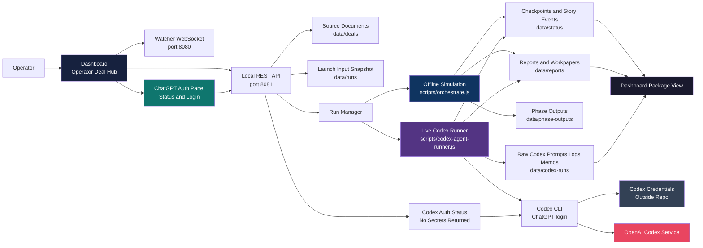
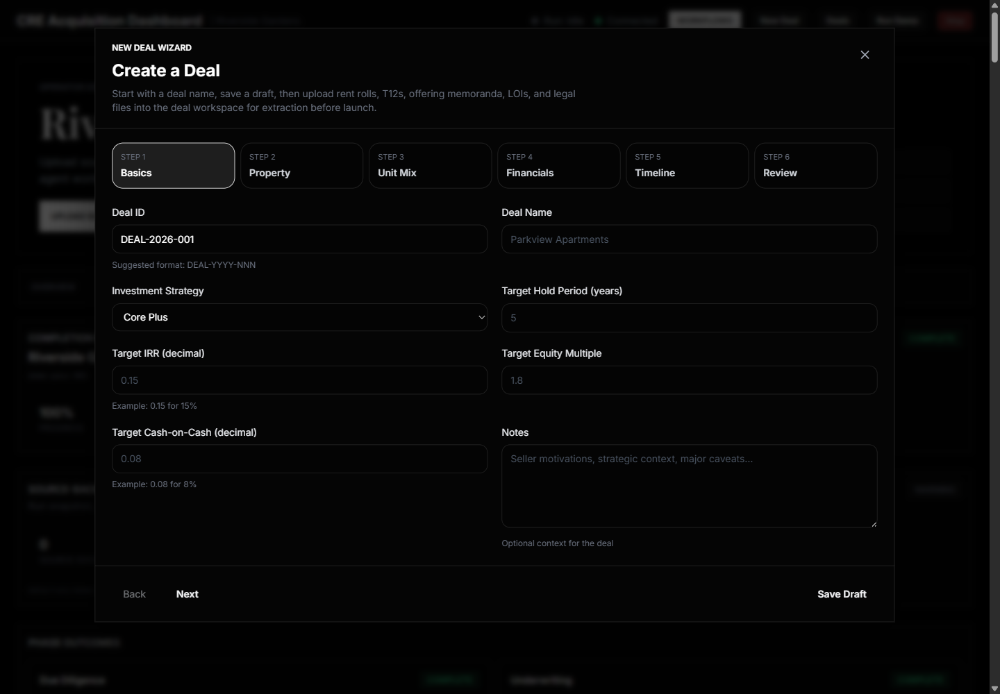
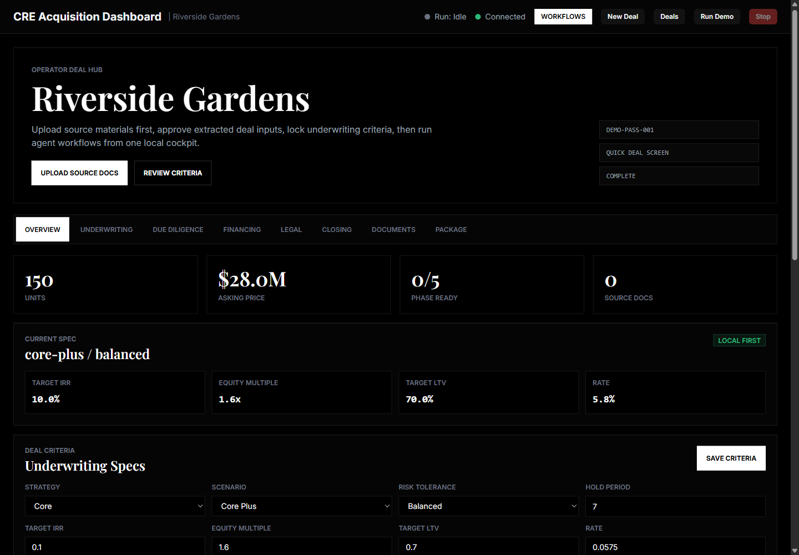
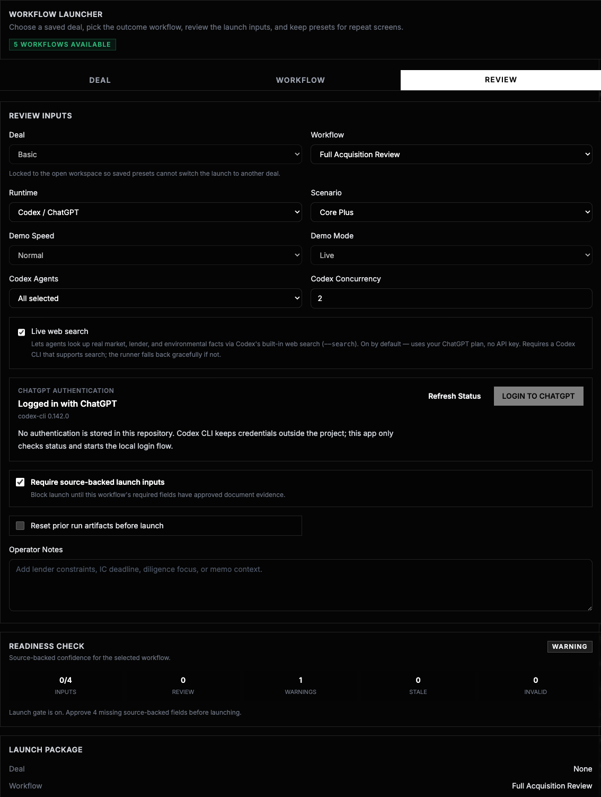
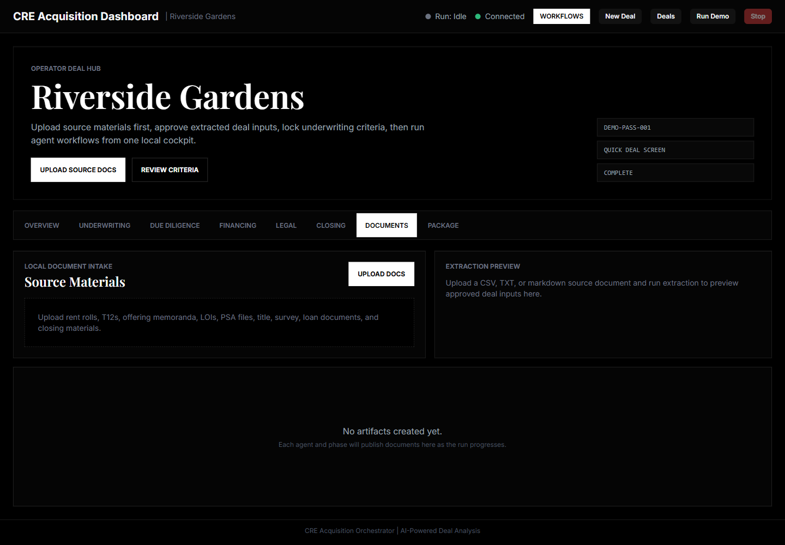
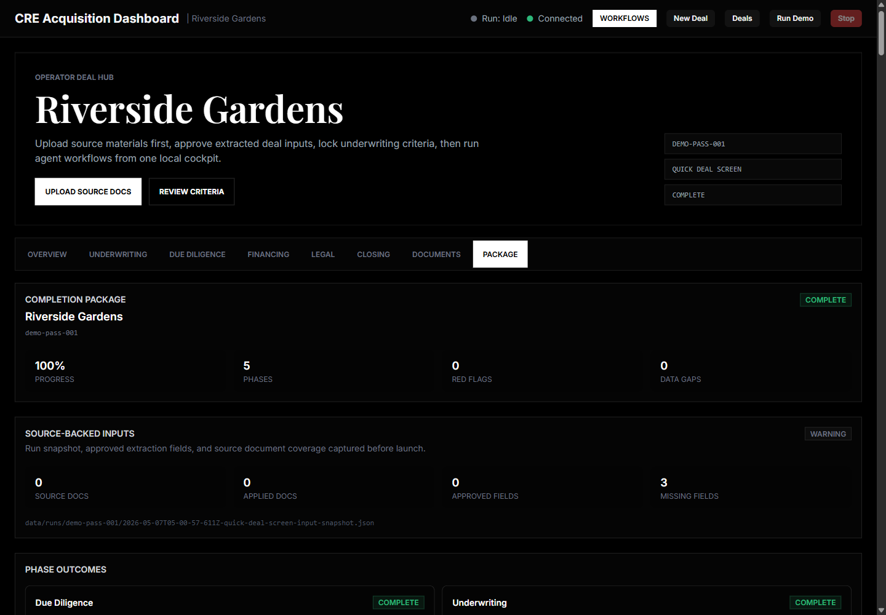

# CRE Acquisition Orchestrator

**A multi-agent AI framework for commercial real estate multifamily acquisitions - from due diligence through closing.**

[](LICENSE)
[](https://nodejs.org/)
[](https://www.typescriptlang.org/)
[](https://reactjs.org/)

---

I've been working on something that I think the CRE industry needs, and I wanted to share where it's at.

A few months ago I wrote about [what happens when you point 489 AI agents at a 200-unit multifamily acquisition](https://avihacker.substack.com/p/489-agents-200-leases-4-hours-this). That article was the vision. This repo is the engineering behind it - the actual agent prompts, orchestration logic, domain knowledge files, data contracts, and simulation engine that make that vision work.

**It's not fully production-ready.** I'm being honest about that. But what IS here is the most in-depth open-source framework I've seen for CRE acquisition orchestration - because nobody else has built one. There are agent frameworks for coding, customer support, and data analysis, but nothing for commercial real estate. CRE acquisitions involve dozens of specialized analyses with complex interdependencies and data handoffs across due diligence, underwriting, financing, legal, and closing. I've tried to model that entire workflow as an AI-native, multi-agent system.

Everything in here - the agent prompts, the skills, the schemas, the pipeline architecture - is yours to use as a starting point. Fork it. Build on it. Adapt it to your own deals, your own workflows, your own investment thesis. All I ask is that you keep the attribution (it's [Apache 2.0 licensed](LICENSE) - just give credit where it started). If this framework helps even one team rethink how they approach acquisitions, it was worth open-sourcing.

Let's bring this industry into the future.

> **Note:** The simulation engine runs fully offline - **no API keys required** to run the demo and explore the architecture. You can see the full pipeline execute with realistic CRE financials right out of the box.

> **Disclaimer:** This project is a reference architecture and educational framework, not production software for making investment decisions. The financial calculations, legal checklists, and agent outputs are for demonstration and learning purposes only. Nothing in this repository constitutes financial, legal, or investment advice. Always consult qualified professionals before making real estate investment decisions. This software is provided "as is" without warranty of any kind - see [LICENSE](LICENSE) for full terms.

---

## What's New in v2.1.0

- **ChatGPT-Backed Codex Runtime** - Run the same markdown agents through the open-source Codex CLI harness with an existing ChatGPT subscription login, from either scripts or the dashboard
- **In-App ChatGPT Login** - The Workflow Launcher checks local Codex status and exposes a **Login to ChatGPT** button for first-time users
- **Dashboard Codex Launches** - The Workflow Launcher and phase workspaces can now launch live Codex runs and publish real Codex memos back into the Package view
- **First-Download Setup** - `npm run setup` prepares offline users cleanly, while `npm run setup -- --require-codex` enforces ChatGPT-authenticated live-agent readiness
- **Codex Artifact Validation** - `npm run validate:codex` checks raw Codex outputs plus dashboard story events, manifests, and package documents
- **Open-Source Release Hygiene** - Docs now distinguish local simulation from live Codex data flow, generated runtime artifacts are ignored, and browser/e2e tests are friendlier for contributors

---

## Release Journey

This project has grown in four public steps: first the agent architecture, then a usable dashboard, then a real operator workspace, and now live Codex-backed agent execution.

| Release | What Changed | Full Notes |
|---------|--------------|------------|
| **v1.0.0 - Initial Public Release** | Published the first open-source CRE acquisition orchestration framework: markdown agents, phase orchestration, schemas, domain skills, deterministic simulation, and sample Parkview output. | [GitHub Release](https://github.com/ahacker-1/cre-acquisition-orchestrator/releases/tag/v1.0.0) |
| **v1.1.0 - Dashboard Deal Wizard** | Moved setup into the product with a guided New Deal Wizard, saved deal library, launch-ready deal flow, and Playwright coverage for key dashboard paths. | [RELEASE_NOTES_v1.1.0.md](RELEASE_NOTES_v1.1.0.md) |
| **v2.0.0 - Operator Deal Hub** | Turned the dashboard into a local-first acquisition cockpit with phase workspaces, document intake, source-backed inputs, outcome workflows, presets, and completion packages. | [RELEASE_NOTES_v2.0.0.md](RELEASE_NOTES_v2.0.0.md) |
| **v2.1.0 - Codex / ChatGPT Workflow Runtime** | Added the optional live-agent path: ChatGPT-authenticated Codex CLI execution, in-app login status, dashboard-launched Codex runs, and release-ready setup validation. | [RELEASE_NOTES_v2.1.0.md](RELEASE_NOTES_v2.1.0.md) |

---

## By the Numbers

| | | | |
|---|---|---|---|
| **31** AI Agents | **8** Domain Knowledge Skills | **10** JSON Schema Contracts | **8** Deal Workspace Views |
| **5** Deal Phases | **5** Outcome Workflows | **65,000+** Lines of Code + Prompts | **252** Files |

---

## Architecture

The system uses a **three-level agent hierarchy** - a master orchestrator coordinates five phase orchestrators, which in turn manage 21 specialist agents across the deal pipeline, plus 4 document ingestion agents. Each agent is defined as a detailed markdown prompt file encoding deep CRE domain knowledge.

```mermaid
graph TD
    M[Master Orchestrator] --> DD[Due Diligence Orchestrator]
    M --> UW[Underwriting Orchestrator]
    M --> FIN[Financing Orchestrator]
    M --> LEG[Legal Orchestrator]
    M --> CLO[Closing Orchestrator]

    DD --> RR[Rent Roll Analyst]
    DD --> OA[OpEx Analyst]
    DD --> PI[Physical Inspection]
    DD --> MS[Market Study]
    DD --> ER[Environmental Review]
    DD --> LT[Legal & Title Review]
    DD --> TC[Tenant Credit]

    UW --> FM[Financial Model Builder]
    UW --> SA[Scenario Analyst]
    UW --> IC[IC Memo Writer]

    FIN --> LO[Lender Outreach]
    FIN --> QC[Quote Comparator]
    FIN --> TS[Term Sheet Builder]

    LEG --> PSA[PSA Reviewer]
    LEG --> TSR[Title & Survey]
    LEG --> EST[Estoppel Tracker]
    LEG --> LDR[Loan Doc Reviewer]
    LEG --> INS[Insurance Coordinator]
    LEG --> TDP[Transfer Doc Preparer]

    CLO --> CC[Closing Coordinator]
    CLO --> FFM[Funds Flow Manager]

    style M fill:#1a1a2e,color:#fff
    style DD fill:#16213e,color:#fff
    style UW fill:#16213e,color:#fff
    style FIN fill:#16213e,color:#fff
    style LEG fill:#16213e,color:#fff
    style CLO fill:#16213e,color:#fff
```



At runtime, specialist agents can spawn additional child agents - the Scenario Analyst runs up to **27 scenario sub-analyses**, Lender Outreach contacts up to **12 lenders in parallel**, and the Estoppel Tracker manages up to **200 unit-level estoppel certificates**.

### Runtime and Artifact Flow



The offline simulation path stays local after dependencies are installed. The live Codex path sends selected prompts and deal context through the user's ChatGPT-authenticated Codex CLI session, then writes both raw Codex outputs and dashboard-readable package artifacts back into the local `data/` tree. Authentication is not stored in this repository; the dashboard only asks the local Codex CLI whether it is installed and logged in, and the **Login to ChatGPT** button starts the Codex CLI login flow on the user's machine.

---

## The Pipeline

The acquisition pipeline models the real-world CRE deal lifecycle with **intelligent phase dependencies** - not a naive sequential chain:

| Phase | Starts When | Key Agents | Output |
|-------|-------------|------------|--------|
| **Due Diligence** | Immediately | Rent Roll Analyst, OpEx Analyst, Physical Inspection, Market Study, Environmental Review, Legal & Title Review, Tenant Credit | Property risk profile, market positioning, physical condition assessment |
| **Underwriting** | DD 100% complete | Financial Model Builder, Scenario Analyst, IC Memo Writer | Pro forma financials, 27-scenario stress test, investment committee memo |
| **Financing** | UW 100% complete | Lender Outreach, Quote Comparator, Term Sheet Builder | Lender quotes, comparative analysis, recommended term sheet |
| **Legal** | DD 80% complete (early start) | PSA Reviewer, Title & Survey, Estoppel Tracker, Loan Doc Reviewer, Insurance Coordinator, Transfer Doc Preparer | Contract review, title clearance, closing document preparation |
| **Closing** | All prior phases complete | Closing Coordinator, Funds Flow Manager | Final closing checklist, funds flow schedule, transfer execution |

The Legal phase demonstrates a key architectural decision: it starts at DD 80% completion to model how real CRE deals work - legal review begins before all diligence is complete, but the Loan Doc Reviewer specifically waits for Financing output before reviewing loan documents.

---

## Complete Agent Catalog

Every agent follows a **19-section prompt anatomy standard** (Identity, Mission, Tools, Inputs, Strategy, Output Format, Quality Gates, Checkpoint Protocol, Resume Protocol, Error Handling, Confidence Scoring, Dealbreaker Detection, Data Gap Handling, Self-Review, Escalation Rules, Logging, Coordination, Constraints, and Examples). See [Agent Development Guide](docs/AGENT-DEVELOPMENT.md) for the full specification.

### Orchestrators (6)

| Agent | Role | Manages |
|-------|------|---------|
| **Master Orchestrator** | Full pipeline coordinator | 5 phase orchestrators, phase dependency enforcement, final go/no-go verdict |
| **Due Diligence Orchestrator** | DD phase manager | 7 specialist agents, parallel launch with dependency ordering |
| **Underwriting Orchestrator** | UW phase manager | 3 agents in sequence: model, scenarios, IC memo |
| **Financing Orchestrator** | Financing phase manager | 3 agents: parallel lender outreach, sequential quote comparison and term sheet |
| **Legal Orchestrator** | Legal phase manager | 6 agents, early start at DD 80%, Loan Doc Reviewer waits for financing |
| **Closing Orchestrator** | Closing phase manager | 2 agents: closing coordinator, then funds flow manager |

### Due Diligence Specialists (7)

| Agent | What It Does | Key Outputs |
|-------|-------------|-------------|
| **Rent Roll Analyst** | Validates unit mix, in-place rents vs market, loss-to-lease calculation, occupancy (economic vs physical), tenant concentration risk, anomaly detection (same-day leases, below-market rents, related-party tenants) | Unit mix summary, rent comp analysis, loss-to-lease matrix, anomaly flags |
| **OpEx Analyst** | Analyzes T-12 operating statement, per-unit expense benchmarking by property class and region, line-item trend analysis, management fee validation, tax reassessment modeling | Expense analysis, per-unit benchmarks, anomaly flags, tax projection |
| **Physical Inspection** | Assesses property condition from inspection reports, estimates capital expenditure needs by system (roof, HVAC, plumbing, electrical, structural), remaining useful life calculations, deferred maintenance quantification | Physical condition report, CapEx schedule, deferred maintenance estimate |
| **Market Study** | Researches submarket fundamentals: demographics, employment, supply pipeline, absorption rates, rent comps from 3+ sources, competitive set analysis, demand drivers | Market analysis, rent comps, competitive positioning, demand forecast |
| **Environmental Review** | Evaluates Phase I ESA findings, contamination risk assessment, regulatory compliance check, remediation cost estimation, vapor intrusion risk, adjacent property concerns | Environmental risk score, remediation needs, regulatory flags |
| **Legal & Title Review** | Analyzes title commitment, searches for exceptions and encumbrances, easement review, lien detection, deed restriction analysis, HOA/CC&R review | Title analysis, exception review, encumbrance schedule |
| **Tenant Credit** | Evaluates tenant creditworthiness, income concentration risk (no single tenant >20% of revenue), lease rollover exposure, credit scoring methodology, Section 8/subsidized housing analysis | Tenant credit report, concentration risk matrix, rollover schedule |

### Underwriting Specialists (3)

| Agent | What It Does | Key Outputs |
|-------|-------------|-------------|
| **Financial Model Builder** | Builds complete 10-year pro forma: GPI, vacancy, EGI, OpEx, NOI, debt service, cash flow, reversion. Applies stabilization assumptions, renovation impact modeling, refinancing scenarios | Base case pro forma, cash flow projections, return metrics (IRR, equity multiple, CoC) |
| **Scenario Analyst** | Runs **27 sensitivity scenarios** by varying 3 dimensions (rent growth, vacancy, exit cap rate) across 3 levels each. Stress-tests the deal under adverse conditions. Spawns child agents for parallel execution | 27-scenario matrix, sensitivity tables, break-even analysis, downside risk quantification |
| **IC Memo Writer** | Synthesizes all DD and UW outputs into a structured investment committee memorandum with executive summary, market overview, financial summary, risk factors, and go/no-go recommendation | Investment committee memo, decision card, risk-weighted recommendation |

### Financing Specialists (3)

| Agent | What It Does | Key Outputs |
|-------|-------------|-------------|
| **Lender Outreach** | Solicits quotes from up to **12 lenders in parallel** across capital sources: Agency (Fannie/Freddie), CMBS, Life Companies, Banks, Bridge/Mezzanine. Matches deal profile to lender criteria | Lender list, outreach results, initial quotes, lender fit scoring |
| **Quote Comparator** | Builds comparison matrix across all received quotes: rate, term, LTV, DSCR requirement, prepayment penalty, recourse, rate lock, good faith deposit. Scores and ranks options | Quote comparison matrix, weighted ranking, recommended lender with rationale |
| **Term Sheet Builder** | Drafts term sheet for selected lender, identifies negotiation leverage points, flags non-standard terms, models rate lock scenarios | Term sheet draft, negotiation points, rate lock analysis |

### Legal Specialists (6)

| Agent | What It Does | Key Outputs |
|-------|-------------|-------------|
| **PSA Reviewer** | Reviews Purchase & Sale Agreement clause by clause: contingency periods, representations, earnest money terms, closing conditions, seller obligations, assignment rights. Flags unfavorable terms | PSA analysis, risk flags, deadline calendar, negotiation recommendations |
| **Title & Survey Reviewer** | Reviews title commitment and ALTA survey: boundary verification, easement impact analysis, encroachment detection, flood zone determination, zoning compliance | Title/survey review, exception analysis, survey issue map |
| **Estoppel Tracker** | Manages estoppel certificate collection for up to **200 units**: tracks sent/received/outstanding, validates tenant-reported terms against rent roll, flags discrepancies in rent amount, lease dates, deposits, landlord obligations | Estoppel status tracker, discrepancy report, completion percentage |
| **Loan Doc Reviewer** | Reviews loan documents from selected lender: note, mortgage/deed of trust, guaranty, environmental indemnity, UCC filings. Cross-references against term sheet for compliance | Loan doc review, compliance check, deviation flags |
| **Insurance Coordinator** | Verifies insurance requirements from lender and PSA: property coverage, liability, flood, windstorm, umbrella. Coordinates with insurance broker, validates adequacy of existing coverage | Insurance compliance report, coverage gap analysis, premium estimates |
| **Transfer Doc Preparer** | Prepares transfer documentation: deed, bill of sale, assignment of leases, FIRPTA certificate, transfer tax calculations, entity verification, closing statement review | Transfer document drafts, entity verification, transfer tax calculation |

### Closing Specialists (2)

| Agent | What It Does | Key Outputs |
|-------|-------------|-------------|
| **Closing Coordinator** | Manages the closing checklist across all workstreams: verifies all conditions precedent are met, tracks outstanding items, coordinates timeline, performs final readiness assessment | Closing checklist, readiness score, outstanding items tracker |
| **Funds Flow Manager** | Prepares the funds flow memo: purchase price allocation, prorations (taxes, rents, deposits), lender disbursement, escrow holdbacks, wire instructions, closing cost breakdown | Funds flow memo, wire instructions, proration schedule, closing cost summary |

### Document Ingestion Agents (4)

| Agent | What It Does | Key Outputs |
|-------|-------------|-------------|
| **Document Orchestrator** | Classifies incoming documents, routes to appropriate parser, manages extraction pipeline, validates completeness | Document manifest, extraction status, routing decisions |
| **Rent Roll Parser** | Extracts structured data from rent roll files (CSV, Excel, PDF): unit numbers, tenant names, lease dates, rents, deposits, status | Structured rent roll JSON, extraction confidence scores |
| **Financials Parser** | Extracts T-12 operating statements: income line items, expense categories, month-over-month trends | Structured financials JSON, line-item mapping |
| **Offering Memo Parser** | Extracts property details, investment highlights, financial projections, and market data from offering memoranda | Structured property data, financial assumptions, market summary |

---

## Domain Knowledge Base

Eight specialized knowledge files encode CRE domain expertise that agents reference during analysis:

| Skill | What It Contains | Used By |
|-------|-----------------|---------|
| **[Underwriting Calculations](skills/underwriting-calc.md)** | Every CRE financial formula: GPI, EGI, NOI, DSCR, LTV, Cap Rate, IRR, Equity Multiple, Cash-on-Cash, Debt Yield, Break-Even Occupancy, GRM, price-per-unit, price-per-SF, OpEx Ratio, Replacement Reserve calculations, loan constant, and amortization | Financial Model Builder, Scenario Analyst, Quote Comparator |
| **[Risk Scoring Framework](skills/risk-scoring.md)** | 9-category risk scoring system (0-100 scale): Ownership & Title, Physical Condition, Environmental, Market, Financial Performance, Tenant, Legal & Regulatory, Capital Markets, and Operational. Weighted by investment strategy (Core-Plus, Value-Add, Distressed) | All DD agents, IC Memo Writer, Master Orchestrator |
| **[Multifamily Benchmarks](skills/multifamily-benchmarks.md)** | Institutional-quality benchmark data: operating expenses by property class (A/B/C) and region, occupancy standards, rent growth benchmarks, CapEx reserves, management fees, turnover costs, insurance ranges, tax reassessment factors | OpEx Analyst, Financial Model Builder, Market Study |
| **[Lender Criteria](skills/lender-criteria.md)** | Full spectrum of lending sources: Agency (Fannie Mae DUS, Freddie Mac Optigo), CMBS, Life Companies, Banks, Bridge/Mezzanine. Eligibility requirements, loan parameters (LTV, DSCR, debt yield, amortization), rate structures, prepayment terms | Lender Outreach, Quote Comparator, Term Sheet Builder |
| **[Legal Checklist](skills/legal-checklist.md)** | Legal compliance requirements across acquisition lifecycle: PSA review items, title requirements, survey standards, environmental compliance, entity formation, transfer documentation, closing conditions | All Legal agents, Closing Coordinator |
| **[Logging Protocol](skills/logging-protocol.md)** | Structured logging format for real-time dashboard consumption: log levels, event types, agent attribution, timestamp formatting, correlation IDs for cross-agent tracing | All agents |
| **[Checkpoint Protocol](skills/checkpoint-protocol.md)** | 3-tier checkpoint system: read/write procedures, schema compliance, resume-from-failure logic, checkpoint versioning, conflict resolution between tiers | All agents, all orchestrators |
| **[Self-Review Protocol](skills/self-review-protocol.md)** | Quality assurance procedures: output completeness validation, calculation cross-checks, confidence scoring methodology, data gap documentation, escalation criteria | All agents |

---

## Data Contracts

Every data handoff between agents and phases is validated against formal **JSON Schema** contracts at runtime. No unvalidated data passes between pipeline stages.

| Schema | Purpose | Validates |
|--------|---------|-----------|
| **[Due Diligence Data](schemas/phases/due-diligence-data.schema.json)** | DD phase output contract | Rent roll analysis, expense benchmarks, market data, physical condition, environmental findings, title status, tenant credit |
| **[Underwriting Data](schemas/phases/underwriting-data.schema.json)** | UW phase output contract | Pro forma financials, scenario results, return metrics, IC memo recommendation |
| **[Financing Data](schemas/phases/financing-data.schema.json)** | Financing phase output contract | Lender quotes, comparison matrix, selected terms, debt sizing |
| **[Legal Data](schemas/phases/legal-data.schema.json)** | Legal phase output contract | PSA review, title clearance, estoppel status, loan doc compliance, insurance verification |
| **[Closing Data](schemas/phases/closing-data.schema.json)** | Closing phase output contract | Readiness checklist, funds flow, outstanding items, final status |
| **[Flag](schemas/common/flag.schema.json)** | Risk flag format | Severity, category, description, agent source, recommended action |
| **[Checklist Item](schemas/common/checklist-item.schema.json)** | Checklist entry format | Status, responsible party, deadline, completion criteria |
| **[Phase Completion Event](schemas/events/phase-completion.schema.json)** | Phase transition event | Phase ID, status, verdict, metrics, timestamp |
| **[Master Checkpoint](schemas/checkpoint/master-checkpoint.schema.json)** | Pipeline state persistence | Deal ID, phase statuses, progress %, timestamps, phase outputs |
| **[Agent Checkpoint](schemas/checkpoint/agent-checkpoint.schema.json)** | Agent state persistence | Agent ID, status, findings, metrics, red flags, data gaps |

---

## Operator Dashboard

A React + TypeScript deal cockpit connects to the local watcher and REST API for deal setup, workflow launch, source-document intake, and live pipeline visualization:

| View | What It Shows |
|-----|--------------|
| **Operator Deal Hub** | Deal lifecycle workspace with Overview, Underwriting, Due Diligence, Financing, Legal, Closing, Documents, and Package tabs |
| **Workflow Launcher** | Guided `Choose Deal -> Choose Outcome -> Review Inputs -> Runtime -> Run Now` launcher with saved local presets |
| **Documents** | Local upload, classification, extraction preview, operator approval, and source-backed input tracking |
| **Run Status** | Phase-by-phase progress, active runtime provider, completion state, findings, and story events |
| **Story Narrative** | Human-readable event stream narrating the deal analysis as it progresses, powered by NDJSON story events |
| **Document Wall** | Visual grid of all documents processed and generated: ingestion status, extraction results, report outputs |
| **Decision Log** | Chronological record of every go/no-go decision, escalation, conditional pass, and dealbreaker flag |
| **Completion Package** | Phase outcomes, workpapers, findings, decision log, document manifest, source-backed inputs, and final recommendation |

## Dashboard Preview

The first screen is designed as an operator command center: start a new deal, set the investment criteria, upload source documents, choose the outcome workflow, and review the package from one local-first cockpit.





| Workflow Launcher | Source Document Workspace |
|-------------------|---------------------------|
|  |  |



---

## Quick Start

### Prerequisites

- [Node.js](https://nodejs.org/) 18+
- npm
- Optional for live AI runs: [OpenAI Codex CLI](https://github.com/openai/codex) signed in with ChatGPT

### One-Time Setup

From a fresh clone on Windows:

```powershell
git clone https://github.com/ahacker-1/cre-acquisition-orchestrator.git
cd cre-acquisition-orchestrator

npm install
npm run setup
```

`npm run setup` verifies Node/npm, installs dashboard dependencies, and tries to prepare the optional Codex live-agent runtime. If Codex is missing or login is skipped, the offline demo and dashboard still work. To require a complete live-agent setup during onboarding, run:

```powershell
npm run setup -- --require-codex
```

When the Codex login flow opens, choose **Sign in with ChatGPT** to use an existing ChatGPT subscription instead of an API key.

If setup is run in offline mode or the login flow is skipped, the dashboard can start it later: open the Workflow Launcher, select **Codex / ChatGPT**, and click **Login to ChatGPT**.

You can check the auth path any time:

```powershell
npm run codex:status
```

Expected login output should say `Logged in using ChatGPT`.

### Run the Offline Simulation

```powershell
npm run demo
```

This runs a complete acquisition pipeline for the sample Parkview Apartments deal (200 units, Austin TX, $32M) using the deterministic simulation engine. No API key or AI subscription is required for this path. All 5 phases execute, all 21 specialist agents produce outputs, and a final report with go/no-go recommendation is generated.

### Start the Dashboard

```powershell
npm run dashboard
```

Open `http://localhost:5173`. The dashboard connects via WebSocket and REST APIs to show the pipeline executing in real time while keeping deal data local.

### Run Live Codex Agents with ChatGPT Login

Live Codex runs use `codex exec` against the same markdown agent instructions in this repo. CLI runs write the raw prompts, logs, manifests, summaries, and agent memos to `data/codex-runs/{runId}/`. Dashboard-launched Codex runs also publish dashboard-readable story events and package documents under `data/status/{dealId}/run-{runId}-*.{ndjson,json}` so the Package view can show the real Codex workpapers.

After `npm run setup` confirms `Logged in using ChatGPT`, run a small live smoke test:

```powershell
npm run codex:smoke
```

Then try a multi-agent Codex workflow:

```powershell
npm run codex:run
```

For the complete Codex-backed agent catalog:

```powershell
npm run codex:run:full
```

The Codex runner uses the open-source Codex CLI harness through `codex exec`. It reads the existing markdown agent prompts, runs selected agents with your ChatGPT subscription login, and defaults to a read-only sandbox so live agents can inspect the repo and deal files without changing project files.

From the dashboard you can now:
- create a new deal in the wizard
- save drafts to the deal library
- open the Operator Deal Hub for each deal
- upload source documents into the deal workspace
- extract and approve source-backed inputs from CSV, TXT, and MD files
- classify PDF/XLSX files for the right phase with extraction marked pending
- choose **Codex / ChatGPT** in the Workflow Launcher and click **Login to ChatGPT** if Codex is not already authenticated
- launch a focused workflow or full acquisition review
- review the completion package after the run finishes

### Local Document Intake

The preferred v2.x path is inside the dashboard:

1. Start the dashboard with `npm run dashboard`
2. Create or open a deal workspace
3. Open the **Documents** view
4. Upload rent rolls, T12s, offering memoranda, LOIs, legal files, PDFs, or XLSX files
5. Run extraction on CSV/TXT/MD documents
6. Approve selected fields before they update the deal inputs

Uploaded files are stored under `data/deals/{dealId}/documents/`, extraction previews under `data/deals/{dealId}/extractions/`, and approved source-backed fields under `data/deals/{dealId}/approved-fields.json`. Runtime deal data stays local and is ignored by git.

Legacy drop-folder ingestion prompts remain available for advanced users with their own prompt runner, but the dashboard upload path is now the main operator workflow.

### Manual Deal Setup

Edit `config/deal.json` with your deal parameters and run:

```powershell
npm run simulate
```

### End-to-End Tests

Run the browser test suite for the dashboard workflow:

```powershell
npm run test:e2e
```

---

## Key Features

- **31 Specialized CRE Agents** - 6 orchestrators, 21 pipeline specialists, and 4 document ingestion agents - each with detailed domain-specific prompts encoding real acquisition expertise
- **19-Section Agent Anatomy** - Every agent follows a standardized prompt structure: Identity, Mission, Tools, Inputs, Strategy, Output Format, Quality Gates, Checkpoint Protocol, Resume Protocol, Error Handling, Confidence Scoring, Dealbreaker Detection, Data Gap Handling, Self-Review, Escalation Rules, Logging, Coordination, Constraints, and Examples
- **Hierarchical Orchestration** - Three-level agent hierarchy with dependency management, concurrent phase execution, and early-start capabilities
- **8 Domain Knowledge Skills** - Reusable CRE expertise files encoding financial formulas, risk scoring frameworks, industry benchmarks, lender criteria, and legal checklists
- **10 JSON Schema Contracts** - Every data handoff validated at runtime - phase outputs, checkpoints, flags, and events all have formal schemas
- **Operator Deal Hub** - React dashboard workspace for criteria, phase playbooks, source documents, workflow launching, and completion packages
- **Workflow Launcher** - Five deterministic outcome workflows with saved local presets and skipped-phase visibility
- **Live Codex Harness** - Optional ChatGPT-login runtime that runs selected markdown agents through Codex CLI and publishes workpapers back into dashboard packages
- **Deterministic Simulation** - Seeded RNG engine produces realistic CRE financials for demo and testing without any API calls
- **3 Investment Scenarios** - Core-Plus, Value-Add, and Distressed configurations with different market assumptions and risk tolerances
- **Failure Injection & Recovery** - Force any agent to fail, resume from 3-tier checkpoint system - models real-world pipeline resilience
- **Local Document Intake** - Upload and classify source files by deal and phase, with CSV/TXT/MD extraction previews and operator-approved input updates
- **Investment Committee Memo** - Auto-generated structured IC memo with go/no-go recommendation synthesizing all pipeline findings

---

## Project Structure

```
cre-acquisition-orchestrator/
├── agents/                    # 25 AI agent prompt files
│   ├── due-diligence/         #   7 DD specialists
│   ├── underwriting/          #   3 UW specialists
│   ├── financing/             #   3 FIN specialists
│   ├── legal/                 #   6 LEG specialists
│   ├── closing/               #   2 CLO specialists
│   └── ingestion/             #   4 document ingestion agents
├── orchestrators/             # 6 orchestrator prompts (master + 5 phase)
├── skills/                    # 8 domain knowledge files (CRE formulas, benchmarks, criteria)
├── schemas/                   # 10 JSON Schema contracts (phases, common, events, checkpoints)
├── config/                    # Deal configuration, workflow catalog, thresholds, agent registry
│   ├── deal.json              #   Sample: Parkview Apartments, Austin TX, 200 units, $32M
│   ├── workflows.json         #   Built-in outcome workflow definitions
│   ├── thresholds.json        #   Investment criteria (DSCR, LTV, cap rate, cash-on-cash)
│   ├── agent-registry.json    #   Agent metadata, dependencies, file mappings
│   └── scenarios/             #   Core-Plus, Value-Add, Distressed configs
├── scripts/                   # Orchestration engine, simulation, utilities
│   ├── orchestrate.js         #   Main workflow-aware pipeline runner
│   ├── demo-run.js            #   Quick demo execution
│   ├── setup.js               #   First-run dependency and optional Codex login helper
│   ├── codex-agent-runner.js  #   ChatGPT-backed Codex CLI agent harness
│   ├── codex-status.js        #   Codex CLI and login status check
│   ├── system-test.js         #   Full system test (3 scenarios + failure + resume)
│   └── lib/                   #   Runtime core, workflow catalog, Codex helpers, story engine
├── dashboard/                 # React + TypeScript Operator Deal Hub
│   ├── src/
│   │   ├── components/        #   Deal workspace, workflow launcher, completion package
│   │   ├── hooks/             #   Checkpoint, workspace, deal library, workflow hooks
│   │   ├── types/             #   Checkpoint, deal, workflow, workspace contracts
│   │   └── styles/            #   Professional CRE cockpit styling
│   ├── server/
│   │   ├── watcher.ts         #   WebSocket + REST API
│   │   ├── run-manager.ts     #   Local deterministic run orchestration
│   │   ├── workflow-service.ts   # Catalog + saved preset APIs
│   │   ├── workspace-service.ts  # Criteria, documents, phase state, deal workspace APIs
│   │   └── parser-service.ts  #   CSV/TXT/MD extraction preview and apply logic
│   └── e2e/                   #   Playwright coverage for portal and workflow flows
├── templates/                 # Output templates (report, IC memo, checkpoints)
├── validation/                # Test fixtures and validation runner
├── documents/                 # Sample deal documents (rent roll CSV, T12, offering memo)
├── docs/                      # Architecture, configuration guide, glossary, troubleshooting
├── demo/                      # Demo scripts, one-pager, FAQ, executive/technical demo guides
├── data/                      # Local runtime data, ignored except curated examples
│   ├── examples/              #   Complete sample run output (Parkview Apartments)
│   ├── deals/{dealId}/        #   Criteria, uploaded docs, manifests, extractions, phase state
│   ├── workflow-presets/      #   Saved local workflow launch presets
│   ├── runs/                  #   Input snapshots and per-run runtime artifacts
│   ├── codex-runs/            #   Live Codex prompts, logs, summaries, and agent memos
│   ├── status/                #   Checkpoints, phase state, agent state, event streams
│   ├── reports/               #   Generated reports and workpapers
│   └── logs/                  #   Local run logs
├── RELEASE_NOTES_v2.1.0.md    # v2.1.0 Codex / ChatGPT workflow release notes
├── RELEASE_NOTES_v2.0.0.md    # v2.0.0 Operator Deal Hub release notes
├── RELEASE_NOTES_v1.1.0.md    # v1.1.0 Dashboard Deal Wizard release notes
└── package.json               # Root validation and orchestration scripts
```

---

## Sample Output

The `data/examples/` directory contains a complete simulation run for the Parkview Apartments deal. Key outputs:

- **[Final Report](data/examples/parkview-2026-001/reports/final-report.md)** - The full acquisition recommendation with go/no-go verdict
- **[IC Memo](data/examples/parkview-2026-001/reports/underwriting/ic-memo-writer-workpaper-v1.md)** - Investment committee memo with financial summary
- **[Phase Outputs](data/examples/parkview-2026-001/phase-outputs/)** - Structured JSON output from each pipeline phase
- **Agent Workpapers** - Individual specialist analyses:
  - [Rent Roll Analysis](data/examples/parkview-2026-001/reports/due-diligence/rent-roll-analyst-workpaper-v1.md)
  - [Financial Model](data/examples/parkview-2026-001/reports/underwriting/financial-model-builder-workpaper-v1.md)
  - [Market Study](data/examples/parkview-2026-001/reports/due-diligence/market-study-workpaper-v1.md)
  - [Environmental Review](data/examples/parkview-2026-001/reports/due-diligence/environmental-review-workpaper-v1.md)
  - [PSA Review](data/examples/parkview-2026-001/reports/legal/psa-reviewer-workpaper-v1.md)

---

## Configuration

### Deal Parameters (`config/deal.json`)

Configure property details, financial assumptions, and data source files for your target acquisition. The sample deal is a 200-unit Class B multifamily in Austin, TX at $32M ($160K/unit).

### Investment Thresholds (`config/thresholds.json`)

Set go/no-go criteria: minimum DSCR (default 1.25x), maximum LTV (75%), target cap rate spread, minimum cash-on-cash return, and dealbreaker conditions.

### Scenarios (`config/scenarios/`)

Three pre-built scenarios with different market assumptions:
- **Core-Plus** - Stable occupancy, moderate rent growth, conservative exit assumptions
- **Value-Add** - Below-market rents, renovation upside, higher risk tolerance
- **Distressed** - High vacancy, elevated cap rates, complex legal, aggressive pricing

---

## Want Individual Skills Without the Orchestration?

If you don't need the full pipeline and just want standalone analysis tools you can drop into ChatGPT, Codex, Claude Code, Cursor, or another prompt runner, check out **[CRE Agent Skills](https://github.com/ahacker-1/cre-agent-skills)**. It is a separate lightweight repo with individual skill files extracted from this orchestrator. No pipeline, no infrastructure, no setup. Just pick a skill and go.

---

## Who Is This For?

- **CRE firms** exploring how AI agents could transform their acquisition workflow
- **Proptech developers** building tools for commercial real estate
- **AI engineers** looking for a real-world, domain-specific agent orchestration reference architecture
- **Anyone curious** about what multi-agent AI systems look like when applied to a complex, regulated industry

This is not an abstract demo - it models the actual workflow that CRE acquisition teams follow, with the domain-specific calculations, legal checklists, and financial models that real deals require.

---

## Roadmap

Potential future directions:

- [x] Codex CLI live-agent harness using ChatGPT subscription login
- [ ] Deeper direct Responses API integration for production hosted deployments
- [ ] Additional property types (office, industrial, retail)
- [ ] Historical deal comparison database
- [ ] Automated lender matching via API
- [ ] Portfolio-level orchestration (multi-deal pipelines)
- [ ] Webhook integrations for deal management systems

---

## Docs

| Document | Description |
|----------|-------------|
| [Architecture](docs/ARCHITECTURE.md) | Agent hierarchy, phase dependencies, data flow, checkpoint system, file structure |
| [First Deal Guide](docs/FIRST-DEAL-GUIDE.md) | Step-by-step walkthrough for running your first acquisition analysis |
| [Deal Configuration](docs/DEAL-CONFIGURATION.md) | Complete field reference for `deal.json` |
| [Threshold Customization](docs/THRESHOLD-CUSTOMIZATION.md) | How to tune investment criteria and risk tolerances |
| [Agent Development](docs/AGENT-DEVELOPMENT.md) | The 19-section agent anatomy standard for building new agents |
| [Dashboard Setup](docs/DASHBOARD-SETUP.md) | Dashboard installation, WebSocket configuration, and tab reference |
| [Launch Procedures](docs/LAUNCH-PROCEDURES.md) | All pipeline launch options and flags |
| [Troubleshooting](docs/TROUBLESHOOTING.md) | Common issues, error patterns, and recovery procedures |
| [Glossary](docs/GLOSSARY.md) | System and CRE terminology reference |

---

## Author

**Avi Hacker, J.D.** - AI Consulting for Commercial Real Estate

I work with CRE firms to build AI systems that transform their acquisition, underwriting, and asset management workflows. This orchestrator grew out of that work - the same architectural patterns I use with clients, open-sourced so the whole industry can build on them.

- [Website - The AI Consulting Network](https://www.theaiconsultingnetwork.com)
- [Newsletter - AI Tactical Toolbox](https://avihacker.substack.com)
- [LinkedIn](https://linkedin.com/in/avi-hacker)

If you're building something in this space or want to talk about how AI agents can transform CRE workflows, reach out.

---

## License

[Apache 2.0](LICENSE) - Use freely, attribution required. See [NOTICE](NOTICE) for details.
