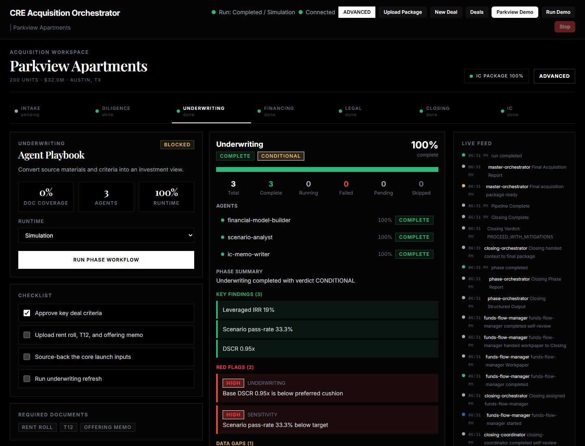
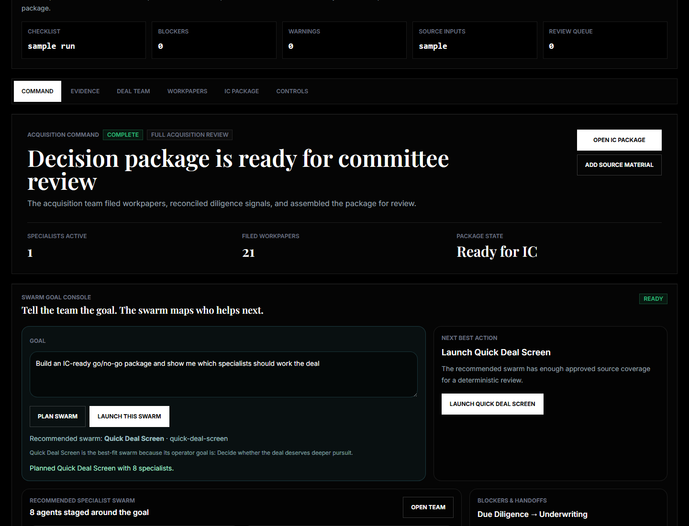
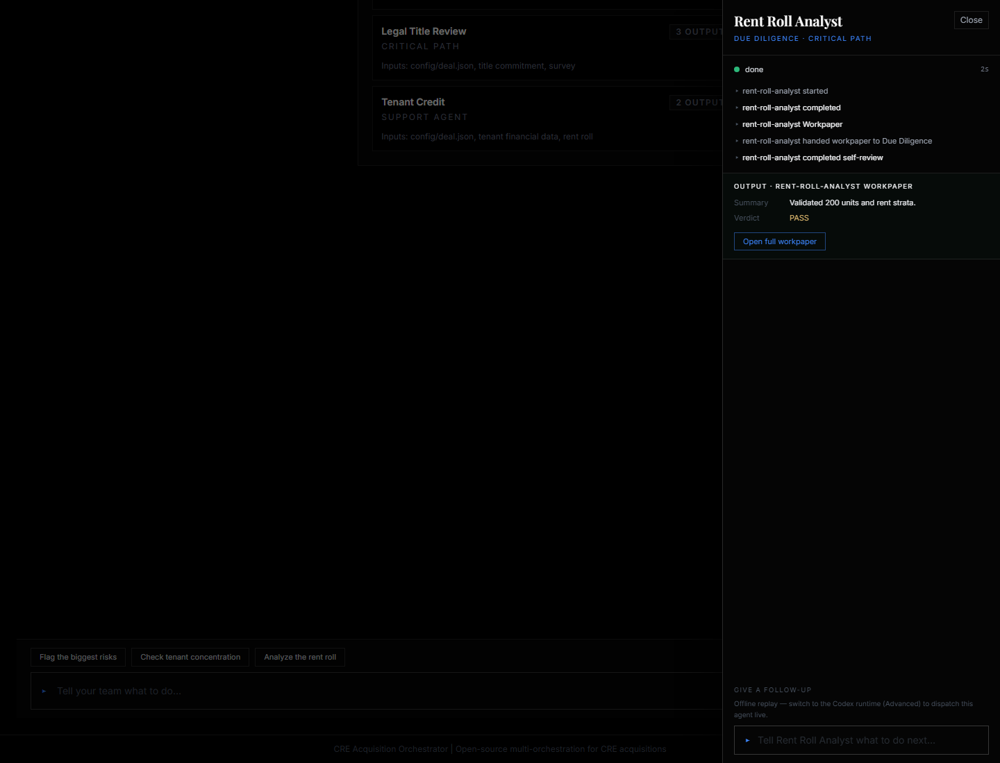
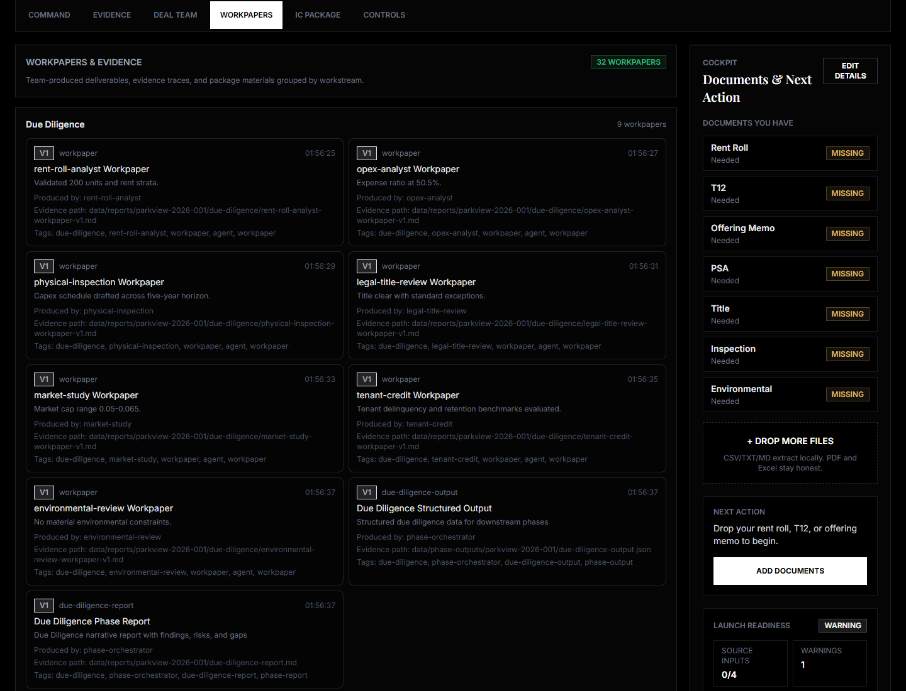
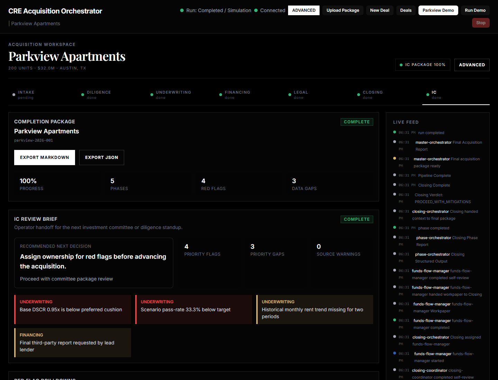
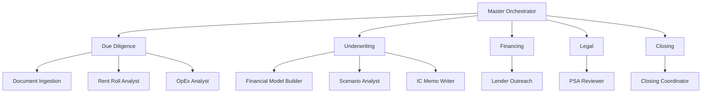
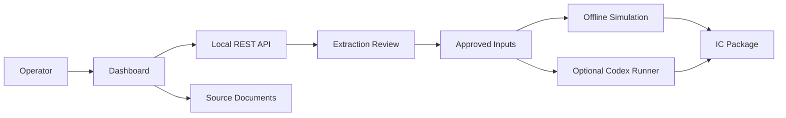

# CRE Acquisition Orchestrator

**A local-first, open-source workspace for multifamily acquisitions: upload deal sources, review extracted evidence, coordinate 31 AI roles, and export an IC-ready package.**

[](LICENSE)
[](https://nodejs.org/)
[](https://www.typescriptlang.org/)
[](https://reactjs.org/)

<!-- HERO: replace with Loom URL -->

This repo models the CRE acquisition process as an AI-native deal workspace. It combines source-backed document intake, reviewable underwriting inputs, specialist agent prompts, deterministic local simulation, and an optional ChatGPT/Codex runtime.

The default path is intentionally local. You can run the dashboard with no API keys, drop a rent roll/T12/offering memo package, review extracted candidate fields with provenance, approve or waive ambiguous values, and export Markdown/JSON for an investment committee starter package.

> **Disclaimer:** This project is a reference architecture and educational framework, not production software for making investment decisions. Nothing here is financial, legal, or investment advice.

---

## First 10 Minutes

1. Install dependencies with [Quick Start](#quick-start).
2. Start the dashboard and open `http://localhost:5173`.
3. Drop a local source package, or use **Start Guided Demo** for the bundled Parkview sample.
4. Review source-backed fields in **Evidence** before they affect underwriting.
5. Open **IC Package** and export the starter package.

For the guided path, use [First Deal Guide](docs/FIRST-DEAL-GUIDE.md). For the shortest deterministic demo, use [Quick Demo](docs/QUICK-DEMO.md).

---

## What It Does

- **Document-first deal intake** - upload rent rolls, T12s, offering memos, PDFs, and supporting files into a local workspace.
- **Source-backed extraction review** - supported XLSX/CSV/TXT/MD sources become candidate fields with confidence, warnings, file hashes, and source-location provenance.
- **Human approval gate** - underwriting inputs do not change until the operator approves/applies trusted fields or waives/rejects ambiguous ones.
- **31-role AI deal team** - 6 orchestrators, 21 acquisition specialists, and 4 document-ingestion roles are defined as markdown prompts.
- **Visible coordination** - dashboard events show specialist messages, handoffs, dependencies, reviews, workpapers, and package status.
- **Two runtime paths** - offline deterministic simulation by default, with an optional ChatGPT-authenticated Codex CLI path for live agent workflows.

---

## By the Numbers

| AI Roles | Skills | Schemas | Workflows | Fixtures | Tests passing |
|----------|--------|---------|-----------|----------|---------------|
| 31 | 8 | 25 | 5 | 10 | 8 |

Counts reflect the current checked-in catalog: 25 specialist prompt files plus 6 orchestrators; 8 domain knowledge files; 25 JSON Schema contracts; 5 workflow definitions; 10 curated fixture files under `fixtures/`; and 8 root `test*` commands tracked by [package.json](package.json).

---

## Current Status

Current `main` is ahead of the latest version tag (`v2.5.1`) and represents the first real-deal workflow pass. The stable baseline remains local-first and review-first:

- **Local by default** - offline dashboard, deterministic Parkview demo, and source-backed extraction require no API keys.
- **Versioned release baseline** - `v2.5.1` adds stale-source launch protection on top of the `v2.5.0` source-backed deal intake release.
- **Current main** - expands messy real-world parser fixtures, adds a curated first-real-deal fixture package, improves mobile/workspace navigation, and hardens local file-race handling during dashboard polling.
- **Known limits** - PDF/OCR extraction, image-only or heavily merged workbooks, production hosted deployments, and autonomous investment decisions remain out of scope.

See [CHANGELOG.md](CHANGELOG.md) for release history and current-main changes.

---

## Visual Demo Tour

The public demo is designed so a first-time visitor can understand the workflow from screenshots before reading architecture docs.











See [Demo Journey](docs/DEMO-JOURNEY.md) for the storyboard and screenshot refresh path.

---

## Architecture

The system uses a three-level hierarchy: a master orchestrator coordinates five phase orchestrators, which manage specialist agents across diligence, underwriting, financing, legal, closing, and document ingestion. The canonical open-source catalog is 31 named AI roles.



For the full role list, responsibilities, domain skills, and schema catalog, see [Agent Catalog](docs/AGENT-CATALOG.md). For implementation details, see [Architecture](docs/ARCHITECTURE.md).

---

## Runtime Flow



The offline simulation path stays local after dependencies are installed. The optional live Codex path sends selected prompts and deal context through the user's ChatGPT-authenticated Codex CLI session, then writes raw Codex outputs and dashboard-readable package artifacts back into the local `data/` tree. Authentication is not stored in this repository.

---

## Quick Start

### Prerequisites

- [Node.js](https://nodejs.org/) 18+
- npm
- Optional for live AI runs: [OpenAI Codex CLI](https://github.com/openai/codex) signed in with ChatGPT

From a fresh clone on Windows:

```powershell
git clone https://github.com/ahacker-1/cre-acquisition-orchestrator.git
cd cre-acquisition-orchestrator

npm install
npm run setup
npm run dashboard
```

Open `http://localhost:5173`. The offline demo and dashboard work even if Codex is missing or login is skipped.

To require a complete live-agent setup during onboarding:

```powershell
npm run setup -- --require-codex
```

Check Codex auth status:

```powershell
npm run codex:status
```

Expected login output should say `Logged in using ChatGPT`.

---

## Common Runs

Run the first real-deal workspace:

```powershell
npm run dashboard
```

Inside the workspace, open **Evidence**, preview extraction for each source file, approve/apply trusted fields, and export the **IC Package** as Markdown or JSON.

Run the deterministic Parkview demo:

```powershell
npm run demo
```

Verify the offline demo path:

```powershell
npm run demo:verify
```

Run browser E2E coverage:

```powershell
npm run test:e2e
```

Run a small live Codex smoke test after ChatGPT login:

```powershell
npm run codex:smoke
```

---

## Project Map

```text
cre-acquisition-orchestrator/
|-- agents/             # 25 specialist prompt files
|-- orchestrators/      # 6 orchestrator prompts
|-- skills/             # 8 domain knowledge files
|-- schemas/            # 10 JSON Schema contracts
|-- config/             # Deal config, workflows, thresholds, agent registry
|-- dashboard/          # React + TypeScript Operator Deal Hub
|-- fixtures/           # First-real-deal and parser fixtures
|-- data/               # Local runtime data, mostly ignored by git
|-- docs/               # Architecture, guides, catalog, troubleshooting
|-- demo/               # Demo scripts and collateral
`-- validation/         # Validation runner and fixtures
```

Runtime deal data stays local and is ignored by git.

---

## Key Docs

| Document | Use It For |
|----------|------------|
| [First Deal Guide](docs/FIRST-DEAL-GUIDE.md) | Bring a local source package into review and export |
| [Quick Demo](docs/QUICK-DEMO.md) | Fast deterministic demo path |
| [Agent Catalog](docs/AGENT-CATALOG.md) | Full 31-role catalog, skills, and schema contracts |
| [Architecture](docs/ARCHITECTURE.md) | System design, hierarchy, dependencies, data flow |
| [Runtime Comparison](docs/RUNTIME-COMPARISON.md) | Offline demo vs live Codex data-sharing boundaries |
| [Launch Procedures](docs/LAUNCH-PROCEDURES.md) | Pipeline launch options and validation commands |
| [Troubleshooting](docs/TROUBLESHOOTING.md) | Common issues and recovery procedures |
| [Roadmap](ROADMAP.md) | Public product and contributor roadmap |
| [Changelog](CHANGELOG.md) | Release history and current-main changes |

---

## Want Individual Skills Without the Orchestration?

If you only want standalone analysis tools for ChatGPT, Codex, Claude Code, Cursor, or another prompt runner, see [CRE Agent Skills](https://github.com/ahacker-1/cre-agent-skills). It is a separate lightweight repo with individual skill files extracted from this orchestrator.

---

## Who Is This For?

- CRE firms exploring AI-assisted acquisition workflows
- Proptech developers building CRE tooling
- AI engineers looking for a domain-specific multi-agent reference architecture
- Operators who want a local, inspectable acquisition workflow before trusting automation

This is not an abstract demo. It models the actual diligence, underwriting, financing, legal, and closing workflow that multifamily acquisition teams follow.

---

## Author

**Avi Hacker, J.D.** - AI Consulting for Commercial Real Estate

- [Website - The AI Consulting Network](https://www.theaiconsultingnetwork.com)
- [Newsletter - AI Tactical Toolbox](https://avihacker.substack.com)
- [LinkedIn](https://linkedin.com/in/avi-hacker)

---

## License

[Apache 2.0](LICENSE) - Use freely, attribution required. See [NOTICE](NOTICE) for details.
