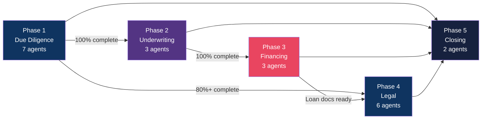
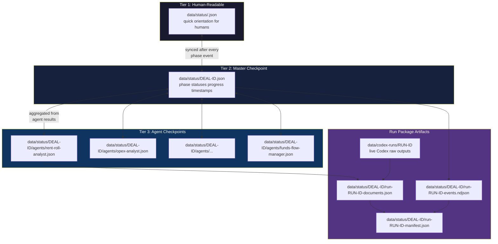
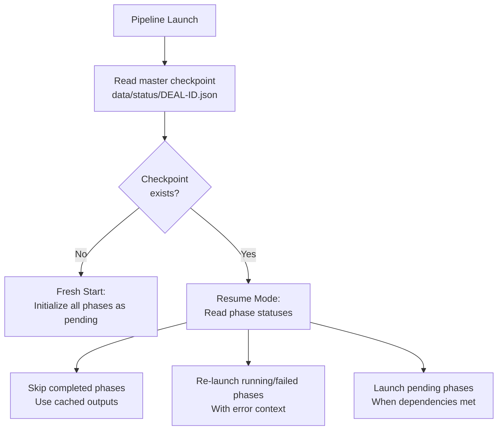

# Architecture

Technical architecture of the CRE Acquisition Orchestration System. This document covers agent hierarchy, phase dependencies, data flow, the checkpoint system, and file structure.

---

## 1. Agent Hierarchy

The system uses a three-level hierarchy: Master Orchestrator, Phase Orchestrators, and Specialist Agents.

```mermaid
graph TD
    MO[Master Orchestrator]

    MO --> DDO[Due Diligence Orchestrator]
    MO --> UWO[Underwriting Orchestrator]
    MO --> FINO[Financing Orchestrator]
    MO --> LEGO[Legal Orchestrator]
    MO --> CLO[Closing Orchestrator]

    DDO --> RRA[rent-roll-analyst]
    DDO --> OPA[opex-analyst]
    DDO --> PI[physical-inspection]
    DDO --> MS[market-study]
    DDO --> ER[environmental-review]
    DDO --> LTR[legal-title-review]
    DDO --> TC[tenant-credit]

    UWO --> FMB[financial-model-builder]
    UWO --> SA[scenario-analyst]
    UWO --> ICM[ic-memo-writer]

    FINO --> LO[lender-outreach]
    FINO --> QC[quote-comparator]
    FINO --> TSB[term-sheet-builder]

    LEGO --> PSA[psa-reviewer]
    LEGO --> TSR[title-survey-reviewer]
    LEGO --> ET[estoppel-tracker]
    LEGO --> LDR[loan-doc-reviewer]
    LEGO --> IC[insurance-coordinator]
    LEGO --> TDP[transfer-doc-preparer]

    CLO --> CC[closing-coordinator]
    CLO --> FFM[funds-flow-manager]

    style MO fill:#1a1a2e,color:#fff
    style DDO fill:#16213e,color:#fff
    style UWO fill:#16213e,color:#fff
    style FINO fill:#16213e,color:#fff
    style LEGO fill:#16213e,color:#fff
    style CLO fill:#16213e,color:#fff
```



### Agent Counts

| Level | Count | Examples |
|-------|-------|---------|
| Master Orchestrator | 1 | master-orchestrator |
| Phase Orchestrators | 5 | due-diligence-orchestrator, underwriting-orchestrator, financing-orchestrator, legal-orchestrator, closing-orchestrator |
| Specialist Agents | 21 | rent-roll-analyst, scenario-analyst, psa-reviewer, etc. |
| **Total** | **27** | |

Additionally, some specialists spawn child agents at runtime:
- **scenario-analyst** spawns up to 27 scenario sub-agents
- **lender-outreach** spawns up to 12 lender-specific sub-agents
- **estoppel-tracker** spawns up to 200 per-unit estoppel sub-agents

---

## 2. Phase Dependency Graph

Phases execute in a specific dependency order. Some parallelism is possible.



### Phase Dependencies Explained

| Phase | Depends On | Can Start When |
|-------|-----------|---------------|
| Due Diligence | Nothing | Immediately at pipeline start |
| Underwriting | Due Diligence | DD is 100% complete (all 7 agents finished) |
| Financing | Underwriting | UW is 100% complete (financial model, scenarios, IC memo done) |
| Legal | Due Diligence (partial) | DD is 80%+ complete (6 of 7 agents). Loan-doc-reviewer waits for Financing. |
| Closing | All prior phases | DD, UW, Financing, and Legal are all complete or conditional |

### Parallel Execution Timeline

```mermaid
gantt
    title Pipeline Execution Timeline
    dateFormat  X
    axisFormat  %s

    section Due Diligence
    5 parallel agents     :dd1, 0, 30
    2 sequential agents   :dd2, after dd1, 15

    section Legal (Early Start)
    PSA + Title + Estoppel + Insurance :leg1, 36, 50
    Loan-Doc-Reviewer (waits for Financing) :leg2, after fin, 20

    section Underwriting
    Financial Model        :uw1, after dd2, 15
    Scenarios (27 parallel):uw2, after uw1, 10
    IC Memo                :uw3, after uw2, 10

    section Financing
    Lender Outreach (parallel) :fin, after uw3, 20
    Quote Comparison           :fin2, after fin, 10
    Term Sheet                 :fin3, after fin2, 10

    section Closing
    Closing Coordinator    :clo1, after fin3, 15
    Funds Flow Manager     :clo2, after clo1, 10
```



---

## 3. Data Flow

Data flows from deal setup and source documents through the dashboard launch layer into one of two runtimes: offline simulation or live Codex. Both paths publish local artifacts that the Package view can read. Codex authentication stays outside the repo: the dashboard can check local status and start `codex login`, but it never reads or returns credential material.

```mermaid
flowchart TD
    subgraph Operator["Operator Workspace"]
        USER[Operator]
        DASH[Dashboard<br/>Operator Deal Hub]
        DOCINTAKE[Document Intake<br/>Upload Extract Approve]
        LAUNCH[Workflow Launcher<br/>Runtime Selector]
        AUTH[ChatGPT Auth Panel<br/>Login Button]
        PACKAGE[Package View]
    end

    subgraph LocalConfig["Local Inputs"]
        DEAL[config/deal.json<br/>or data/deals/{dealId}/deal.json]
        THRESH[config/thresholds.json]
        REG[config/agent-registry.json]
        WORKFLOWS[config/workflows.json]
        SOURCES[data/deals/{dealId}/documents]
        SNAPSHOT[data/runs/{dealId}/input-snapshot.json]
    end

    subgraph Runtime["Runtime Paths"]
        RM[Run Manager]
        SIM[Offline Simulation<br/>scripts/orchestrate.js]
        CODEX[Live Codex Runner<br/>scripts/codex-agent-runner.js]
        CLI[Codex CLI<br/>ChatGPT login]
        AUTHSTORE[Codex Credentials<br/>outside repository]
    end

    subgraph Artifacts["Local Artifacts"]
        STATUS[data/status<br/>checkpoints events manifests]
        PHASE[data/phase-outputs]
        REPORTS[data/reports<br/>reports workpapers]
        RAW[data/codex-runs<br/>prompts logs memos]
    end

    USER --> DASH
    DASH --> DOCINTAKE
    DASH --> LAUNCH
    LAUNCH --> AUTH
    DOCINTAKE --> SOURCES
    SOURCES --> SNAPSHOT
    DEAL --> SNAPSHOT
    THRESH --> SNAPSHOT
    REG --> SNAPSHOT
    WORKFLOWS --> SNAPSHOT
    SNAPSHOT --> RM
    LAUNCH --> RM
    AUTH --> CLI

    RM --> SIM
    RM --> CODEX
    SIM --> STATUS
    SIM --> PHASE
    SIM --> REPORTS
    CODEX --> CLI
    CODEX --> RAW
    CODEX --> STATUS
    CODEX --> REPORTS
    CLI --> AUTHSTORE

    STATUS --> PACKAGE
    REPORTS --> PACKAGE
    RAW --> PACKAGE
    PACKAGE --> DASH

    style DASH fill:#16213e,color:#fff
    style SIM fill:#0f3460,color:#fff
    style CODEX fill:#533483,color:#fff
    style AUTH fill:#0f766e,color:#fff
    style AUTHSTORE fill:#334155,color:#fff
    style CLI fill:#e94560,color:#fff
    style PACKAGE fill:#1a1a2e,color:#fff
```

### Input Files

| File | Purpose | When Read |
|------|---------|-----------|
| `config/deal.json` | Property details, financials, timeline | Pipeline start |
| `config/thresholds.json` | Investment criteria for go/no-go decisions | Pipeline start and final verdict |
| `config/agent-registry.json` | Maps agent names to prompt files | Pipeline start |
| `config/workflows.json` | Built-in workflow catalog and phase/agent selections | Dashboard or CLI workflow launch |
| `data/deals/{dealId}/documents/` | Uploaded source documents | Dashboard launch readiness and input snapshot |
| `data/runs/{dealId}/...input-snapshot.json` | Source-backed launch package | Simulation and live Codex runs |

### Output Files

| File | Generated By | Contents |
|------|-------------|----------|
| `data/reports/{deal-id}/final-report.md` | Master Orchestrator | Complete acquisition report with verdict |
| `data/reports/{deal-id}/dd-report.md` | DD Orchestrator | Due diligence findings |
| `data/reports/{deal-id}/underwriting-report.md` | UW Orchestrator | Financial model, scenarios |
| `data/reports/{deal-id}/financing-report.md` | Financing Orchestrator | Lender quotes, terms |
| `data/reports/{deal-id}/legal-report.md` | Legal Orchestrator | Title, PSA, estoppel, insurance |
| `data/reports/{deal-id}/closing-report.md` | Closing Orchestrator | Readiness assessment |
| `data/codex-runs/{runId}/summary.md` | Codex Runner | Live Codex run summary |
| `data/codex-runs/{runId}/{phase}/{agent}.md` | Codex Specialist | Live Codex memo for a markdown agent |
| `data/status/{dealId}/run-{runId}-events.ndjson` | Story Engine | Dashboard-readable run events |
| `data/status/{dealId}/run-{runId}-documents.json` | Story Engine | Dashboard Package document registry |

---

## 4. Checkpoint System

The system uses a 3-tier checkpoint architecture for crash resilience and resume capability.



### Tier 1: data/status/<deal-id>.json

- **Location:** Project root (`data/status/<deal-id>.json`)
- **Format:** Markdown
- **Updated:** After every phase completion or significant event
- **Purpose:** Human-readable status for quick orientation when resuming or checking progress

### Tier 2: Master Checkpoint

- **Location:** `data/status/{deal-id}.json`
- **Format:** JSON
- **Updated:** After every phase status change
- **Contents:**
  - Deal identification (dealId, dealName, address)
  - Phase-by-phase status (pending / running / complete / failed / conditional)
  - Overall progress percentage (weighted: DD 25%, UW 20%, FIN 20%, LEG 25%, CLO 10%)
  - Phase outputs and data for downstream phases
  - Timestamps (startedAt, lastUpdated, completedAt)

### Tier 3: Agent Checkpoints

- **Location:** `data/status/{deal-id}/agents/{agent-name}.json`
- **Format:** JSON
- **Updated:** When each agent completes or fails
- **Contents:**
  - Agent identification and phase
  - Status (pending / running / complete / failed)
  - Findings, metrics, red flags, data gaps
  - Timestamps and duration

### Resume Flow



---

## 5. File Structure

Complete directory tree of the `cre-acquisition/` project.

```
cre-acquisition/
├── data/status/<deal-id>.json                   # Tier 1: Human-readable session state
├── LAUNCH.md                          # Quick-start launch commands
│
├── config/
│   ├── deal.json                      # YOUR DEAL - edit this per acquisition
│   ├── deal-example.json              # Fully populated reference example
│   ├── deal-schema.json               # JSON Schema for deal.json validation
│   ├── thresholds.json                # Investment criteria (PASS/FAIL/CONDITIONAL)
│   ├── agent-registry.json            # Agent name → prompt file mapping
│   └── examples/
│       ├── core-plus-multifamily.json  # Example: core-plus strategy
│       └── opportunistic-multifamily.json # Example: opportunistic strategy
│
├── orchestrators/
│   ├── master-orchestrator.md         # Full pipeline coordinator
│   ├── due-diligence-orchestrator.md  # DD phase (7 agents)
│   ├── underwriting-orchestrator.md   # UW phase (3 agents)
│   ├── financing-orchestrator.md      # Financing phase (3 agents)
│   ├── legal-orchestrator.md          # Legal phase (6 agents)
│   └── closing-orchestrator.md        # Closing phase (2 agents)
│
├── agents/
│   ├── due-diligence/
│   │   ├── rent-roll-analyst.md       # Rent roll analysis, unit mix, loss-to-lease
│   │   ├── opex-analyst.md            # Operating expense analysis, anomaly detection
│   │   ├── physical-inspection.md     # Property condition, capex estimation
│   │   ├── market-study.md            # Market research, comps, demographics
│   │   ├── environmental-review.md    # Phase I ESA, contamination risk
│   │   ├── legal-title-review.md      # Title search, exceptions, encumbrances
│   │   └── tenant-credit.md           # Tenant creditworthiness, concentration risk
│   ├── underwriting/
│   │   ├── financial-model-builder.md # Base case pro forma, cash flow projections
│   │   ├── scenario-analyst.md        # 27-scenario sensitivity analysis
│   │   └── ic-memo-writer.md          # Investment committee memo
│   ├── financing/
│   │   ├── lender-outreach.md         # Multi-lender solicitation (up to 12 lenders)
│   │   ├── quote-comparator.md        # Quote comparison matrix, best terms
│   │   └── term-sheet-builder.md      # Term sheet drafting, negotiation points
│   ├── legal/
│   │   ├── psa-reviewer.md            # Purchase & Sale Agreement analysis
│   │   ├── title-survey-reviewer.md   # Title commitment and survey review
│   │   ├── estoppel-tracker.md        # Per-unit estoppel tracking (up to 200 units)
│   │   ├── loan-doc-reviewer.md       # Loan document review and compliance
│   │   ├── insurance-coordinator.md   # Insurance coverage verification
│   │   └── transfer-doc-preparer.md   # Transfer document preparation
│   └── closing/
│       ├── closing-coordinator.md     # Closing checklist, readiness assessment
│       └── funds-flow-manager.md      # Funds flow memo, wire instructions
│
├── skills/
│   ├── logging-protocol.md            # Standardized logging format
│   ├── checkpoint-protocol.md         # Checkpoint read/write procedures
│   ├── underwriting-calc.md           # Financial calculation formulas
│   ├── risk-scoring.md                # Risk score computation methodology
│   ├── multifamily-benchmarks.md      # Industry benchmark data
│   ├── lender-criteria.md             # Lender qualification criteria
│   ├── legal-checklist.md             # Legal compliance checklist
│   └── self-review-protocol.md        # Agent self-review procedures
│
├── templates/
│   ├── agent-checkpoint.json          # Template for agent checkpoint files
│   ├── phase-checkpoint.json          # Template for phase checkpoint files
│   ├── report-template.md             # Template for phase reports
│   └── ic-memo-template.md            # Template for IC memo
│
├── data/
│   ├── deals/
│   │   └── {deal-id}/
│   │       ├── deal.json              # Local user-created or extraction-updated deal config
│   │       ├── criteria.json          # Deal-specific underwriting criteria
│   │       ├── document-manifest.json # Source document catalog
│   │       ├── approved-fields.json   # Source-backed approved fields
│   │       ├── documents/             # Uploaded source documents
│   │       └── extractions/           # Extraction previews
│   ├── workflow-presets/              # Saved local workflow launcher presets
│   ├── runs/                          # Source-backed run input snapshots
│   ├── logs/
│   │   └── {deal-id}/
│   │       ├── master.log             # Master orchestrator activity log
│   │       ├── due-diligence.log      # DD phase log
│   │       ├── underwriting.log       # UW phase log
│   │       ├── financing.log          # Financing phase log
│   │       ├── legal.log              # Legal phase log
│   │       └── closing.log            # Closing phase log
│   ├── phase-outputs/
│   │   └── {deal-id}/                 # Intermediate phase output data
│   ├── codex-runs/
│   │   └── {run-id}/                  # Live Codex prompts, logs, summaries, and agent memos
│   ├── reports/
│   │   └── {deal-id}/
│   │       ├── final-report.md        # Complete acquisition report
│   │       ├── dd-report.md           # Due diligence report
│   │       ├── underwriting-report.md # Underwriting report
│   │       ├── financing-report.md    # Financing report
│   │       ├── legal-report.md        # Legal report
│   │       └── closing-report.md      # Closing report
│   └── status/
│       └── {deal-id}.json             # Tier 2: Master checkpoint
│           └── agents/
│               ├── rent-roll-analyst.json
│               ├── opex-analyst.json
│               └── ...                # One file per agent (Tier 3)
│
├── dashboard/
│   ├── package.json                   # Dashboard dependencies
│   ├── vite.config.ts                 # Vite configuration
│   ├── server/                        # Local watcher, REST API, workflow/document services
│   └── src/                           # React operator portal source
│
├── validation/
│   ├── test-deal.json                 # Synthetic test deal for validation
│   ├── validation-runner.md           # Validation suite runner
│   ├── synthetic-checkpoint.json      # Test checkpoint data
│   └── expected-outputs/              # Expected results for validation
│
├── scripts/                           # Utility scripts
├── build/                             # Build system files (used during development)
└── docs/
    ├── PREREQUISITES.md               # Software and account requirements
    ├── FIRST-DEAL-GUIDE.md            # Step-by-step first deal walkthrough
    ├── ARCHITECTURE.md                # This file
    ├── DEAL-CONFIGURATION.md          # deal.json field reference
    ├── THRESHOLD-CUSTOMIZATION.md     # Threshold tuning guide
    └── LAUNCH-PROCEDURES.md           # All launch options
```

---

## 6. Runtime Model

The project now has two first-class runtime paths plus a local auth status path:

1. **Offline deterministic runtime** - `scripts/orchestrate.js` runs the complete local simulation with no API key or subscription. It writes checkpoints, phase outputs, logs, story events, workpapers, and final reports for the dashboard.
2. **Live Codex runtime** - `scripts/codex-agent-runner.js` uses the open-source Codex CLI harness via `codex exec`. It runs selected markdown agents with a ChatGPT login, defaults to a read-only sandbox, writes raw Codex outputs to `data/codex-runs/{runId}/`, and publishes dashboard package artifacts under `data/status/{dealId}/run-{runId}-*.{ndjson,json}`.
3. **Codex auth status path** - `GET /api/codex/status` reports local readiness without secrets, and `POST /api/codex/login` starts `codex login` so the user can choose ChatGPT in the Codex browser flow.

The live Codex execution model:

1. The runner verifies `codex login status`.
2. It reads `config/workflows.json`, `config/agent-registry.json`, `config/deal.json`, and the selected scenario.
3. It selects agents from a workflow, phase, or explicit `--agent` filter.
4. It launches one `codex exec` process per selected specialist, up to the requested `--concurrency`.
5. Each Codex specialist reads the local agent, orchestrator, skill, threshold, and deal files.
6. Each specialist returns structured Markdown: verdict, findings, red flags, data gaps, and follow-up.
7. The runner writes prompts, logs, outputs, `manifest.json`, and `summary.md` under `data/codex-runs/{runId}/`.
8. The runner registers Codex memos and run summaries with the story engine so dashboard-launched live runs appear in the Package view through `data/status/{dealId}/run-{runId}-events.ndjson`, `documents.json`, and `manifest.json`.

Legacy prompt-runner launch prompts remain useful for advanced users who already operate in another agent runtime, but the recommended first-download live-AI path is Codex CLI with ChatGPT login.

### Key Design Principles

- **Markdown-native:** All agent behavior is defined in `.md` prompt files, not code
- **Stateless agents:** Each agent invocation is independent; all context is passed via prompts
- **Crash-resilient:** 3-tier checkpoints mean no work is lost on interruption
- **Observable:** Structured logs and real-time dashboard provide full visibility
- **Configurable:** Deal parameters and investment thresholds are external JSON, not embedded in prompts
